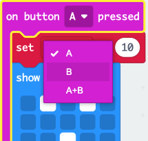

الميكروبِت حاسوب صغير يستعمل للتعامل مع العالم حولك.

هذا المشروع سيساعدك على اكتشاف ما يستطيع فعله المايكروبت.

### ما ستصطنع

هذا المشروع يذكرك أن تكون عفويا، وستستمتع، وتأخذ وضعية! يمكن أن يكون هذا بعد يوم طويل في المدرسة، أو طريقة لإسعاد أصدقائك. يمكنك أن تبرمج أزرار المايكرو:بت لتذكرك أن تستمع و تفرح.

في هذا المشروع ستصنع تذكير خفيف و ممتع.

سوف:
+ تعرض الأيقونات والكلمات والرقم على أضواء اللد.
+ استخدم كتل `if`{:class='microbitlogic'} للتحكم بما يتم عرضه
+ استخدم كتلة `pause</0 {:class='microbitbasic'} لإنشاء مؤقّت للعد التنازلي</li>
<li>تشغيل الأصوات</li>
<li>إستخدم أزرار لتغيير العرض</li>
</ul>

<p spaces-before="0">--- no-print ---</p>

<h3 spaces-before="0">شغِل</h3>

<p spaces-before="0">--- task ---</p>

<ul>
<li>ماذا يحدث عند بدء البرنامج؟</li>
<li>ماذا يحدث عند تشغيل العد التنازلي؟</li>
<li>ماذا يحدث عند انتهاء العد التنازلي؟</li>
<li>ماذا يحدث إذا<code>press`على الزر A؟
+ ماذا يحدث إذا`press`على الزر B؟

<div style="position:relative;height:100%;padding-bottom:125%;padding-top:0;overflow:hidden;">
<iframe style="position:absolute;top:0;left:0;width:100%;height:100%;" src="https://makecode.microbit.org/---run?id=_KiYLAWM3cip4" allowfullscreen="allowfullscreen" sandbox="allow-popups allow-forms allow-scripts allow-same-origin" frameborder="0"></iframe>
</div>

--- /task ---

--- /no-print ---

### افتح MakeCode

لبدء إنشاء مشروع micro:bit الخاص بك، افتح محرر MakeCode.

--- task ---

افتح محرر MakeCode على [makecode.microbit.org](https://makecode.microbit.org){:target="_blank"}

--- collapse ---

---
title: النسخة غير المتصلة من المحرر
---

يوجد أيضاً نسخة  [downloadable version of the MakeCode editor](https://makecode.microbit.org/offline-app){:target="_blank"}.

--- /collapse ---

--- /task ---

بمجرد فتح المحرر، أنشئ مشروعًا جديدًا وأعطِ مشروعك اسمًا.

--- task ---

إضغط على زر  **New Project**


--- /task ---

--- task ---

أعطِ مشروعك الاسم <0>silly reminder</0> ثم اضغط على <1>Create</1>.


**Tip:** لجعل مشروعك أسهل في العثور عليه لاحقًا، اختر له اسمًا مفيدًا يرتبط بما تقوم بإنشائه.

--- /task ---

### محرر "MakeCode"

تم إنشاؤه من قبل مؤسسة micro:bit، ويحتوي **محرر MakeCode** على كل ما تحتاجه للبدء في البرمجة باستخدام micro:bit.


على الجانب الأيسر. يوجد **simulator**. هذا هو micro:bit افتراضي يمكنك استخدامه لاختبار الكود الخاص بك!

يحتوي على جميع المزايا والأزرار الموجودة في micro:bit V2، بما في ذلك:
+ شاشة LED
+ مكبّر الصوت
+ ميكرفون
+ ازرار الادخال
    + A
    + B
    + الشّعار

في الوسط، توجد**blocks panel**، والتي تم ترميزها بالألوان وتتيح لك الوصول إلى كتل التعليمات البرمجية المختلفة.

على الجانب الأيمن، توجد **code editor panel** . هذا هو المكان الذي يمكنك فيه سحب وإفلات الكتل لإنشاء برنامجك.

تحتوي لوحة محرر MakeCode بالفعل على كتلتين:: `on start`{:class='microbitbasic'}و `forever`{:class='microbitbasic'}.

### عرض الايقونة

ستستخدم كتلة  `on start`{:class='microbitbasic'} لمعرفة كيفية عمل مصابيح LED على جهاز المحاكاة.

--- task ---

إضغط على قائمة  `Basic`{:class='microbitbasic'}

سيتم توسيع هذا لإظهار الكتل المتوفرة لك.


اسحب قتلة`show icon`{:class='microbitbasic'}

يجب أن يتناسب هذا مع مكانه مثل قطعة اللغز.

```microbit
basic.showIcon(IconNames.Heart)
```

--- /task ---

--- task ---

إضغط على السهم الأسفل على كتلة <0>show icon</0>{:class='microbitbasic'} و إختر أيقونة.


في هذا المثال، اخترنا أيقونة `heart`.

--- /task ---

--- task ---

**اختبار:** يجب أن تضيء شاشة LED على جهاز المحاكاة، وتعرض الأيقونة.

أحسنت! لقد قمت بجعل مصابيح LED الموجودة على micro:bit تضيء!

--- /task ---

### اختر بعض الوضعيات

عليك تحديد بعض الوجوه أو الوضعيات السخيفة والمسلية التي سوف تفعلها عندما تضغط زر على micro:bit. إليك بعض الأفكار التي يمكنك تجربتها:

+ ابتسامة كبيرة مبتذلة
+ قفزات جاك
+ كن شجرة
+ وضعية ثني العضلات

### انشئ مؤقت لكل وضعية

قم بإنشاء متغير سيتم استخدامه في مؤقت يخبرك بمدة الاحتفاظ بكل وضعية.

--- task ---

افتح القائمة`Variables`{:class='microbitvariables'}، ثم إضغط **Make a variable**.


--- /task ---

--- task ---

قم بتسمية المتغير الجديد `timer`، ثم انقر فوق الزر **OK**.


--- /task ---

سيتم إنشاء كتل جديدة يمكنك وضعها في برنامجك لاستخدام وتغيير القيمة المخزنة في المتغير `timer` .


--- task ---

اسحب كتلة `set`{:class='microbitvariables'} **أسفل كتلة** the `show icon`{:class='microbitbasic'}.

```microbit
let timer = 0
basic.forever(function () {
    basic.showIcon(IconNames.Heart)
    timer = 0
})
```

--- /task ---

### تعيين رمز لكل وضعية

ستقوم الآن ببرمجة أزرار الإدخال A و B على micro:bit لمساعدتك في تحديد الوضعية السخيفة التي تريد القيام بها.

--- task ---

إضغط على قائمة  `Input`{:class='microbitinput'} و إسحب كتلةn `on button`{:class='microbitinput'} إلى **code editor panel**.

```microbit
input.onButtonPressed(Button.A, function () {

})
```

--- /task ---

--- task ---

من قائمة `Basic`{:class='microbitbasic'} , إسحب كتلة   `show leds`{:class='microbitbasic'} داخل كتلة`on button`{:class='microbitinput'}

```microbit
input.onButtonPressed(Button.A, function () {
    basic.showLeds(`
        . . . . .
        . . . . .
        . . . . .
        . . . . .
        . . . . .
        `)
})
```

انقر على المربعات لرسم وضعيتك. سيتم إضاءة المربعات البيضاء على شاشة LED.

في هذا المثال، قمنا برسم وجه مبتسم كوضعية سخيفة.

```microbit
input.onButtonPressed(Button.A, function () {
    basic.showLeds(`
        . # . # .
        . . . . .
        . . # . .
        # . . . #
        . # # # .
        `)
})
```

--- /task ---

ينبغي عرض الأيقون لبعض الوقت قبل تغييره.

ستستخدم كتلة `pause`{:class='microbitbasic'}  لهذا يؤدي هذا إلى إيقاف البرنامج مؤقتًا لمدة محددة من المللي ثانية (1/1000 من الثانية).

--- task ---

من قائمة  `Basic`{:class='microbitbasic'} , إسحب كتلة `pause`{:class='microbitbasic'} تحت كتلة `show leds`{:class='microbitbasic'}.

```microbit
input.onButtonPressed(Button.A, function () {
    basic.showLeds(`
        . # . # .
        . . . . .
        . . # . .
        # . . . #
        . # # # .
        `)
    basic.pause(100)
})
```

--- /task ---

--- task ---

غيّر القيمة `100` في كتلة `pause`{:class='microbitbasic'} إلى رقم أكبر بحيث تكون فترة التوقف أطول ويُعرض الرمز لفترة أطول. لقد قمنا بضبطها إلى ثانيتين (`2000`) في هذا المثال.

```microbit
input.onButtonPressed(Button.A, function () {
    basic.showLeds(`
        . # . # .
        . . . . .
        . . # . .
        # . . . #
        . # # # .
        `)
    basic.pause(2000)
})
```

--- /task ---

--- task ---

إضغط بزر الفأرة الأيمن على كتلة `set`{:class='microbitvariables'} داخل كتلة `on start`{:class='microbitbasic'}.

إضغط على **Duplicate** لعمل نسخة منها.

ضع كتلة `set`{:class='microbitvariables'} المكررة فوق كتلة `show leds`{:class='microbitbasic'}.

غيّر القيمة من `0` إلى `10` في الكتلة الجديدة.


--- /task ---

للسماح باختيار أكثر من وضعية، ستستخدم الزر B.

--- task ---

انقر بزر الفأرة الأيمن على كتلة `on button`{:class='microbitinput'} بالكامل.

إضغط على `Duplicate` لعمل نسخة منها.

سيكون لديك الآن كتلتان `on button`{:class='microbitinput'} في **لوحة محرر الأكواد**.

--- /task ---

--- task ---

انقر على السهم الصغير بجوار `A`{:class='microbitinput'} في الكتلة المكررة `on button`{:class='microbitinput'}. غيّر `A`{:class='microbitinput'} إلى `B`{:class='microbitinput'}.



--- /task ---

--- task ---

لإنشاء أيقونة وضعية جديدة، غيّر المربعات في كتلة `show leds`{:class='microbitbasic'} الجديدة داخل كتلة `on button`{:class='microbitinput'} الجديدة.

--- /task ---

--- task ---

**اختبر**

+ اضغط الزر `A` على المحاكي لترى أيقونة LED المعروضة. لاحظ مدة عرضها.
+ قم بنفس الشيء لاختبار الزر `B`.
+ غيّر القيمة في كتلة `pause`{:class='microbitbasic'} لزيادة أو تقليل مدة عرض الأيقونات عند الضغط على كل زر.

--- /task ---

### إنشاء عدٍّ تنازلي

ستنشئ الآن عدًّا تنازليًا لمدة 10 ثوانٍ.

ستقل قيمة المتغير `timer`{:class='microbitvariables'} بمقدار `1` كل ثانية، ولكن **فقط** إذا كان المؤقت **أكبر من 0**.

--- task ---

من قائمة `Logic`{:class='microbitlogic'}، اسحب كتلة `if`{:class='microbitlogic'}.

ضعها داخل كتلة `forever`{:class='microbitbasic'}.

```microbit
basic.forever(function () {
    if (true) {

    }
})
```

--- /task ---

--- task ---

من قائمة <0>Logic</0>{:class='microbitlogic'}، اسحب كتلة المقارنة <0>0 = 0</0>{:class='microbitlogic'}.


غيّر الرمز `=`{:class='microbitlogic'} إلى `>`{:class='microbitlogic'} (أكبر من) باستخدام السهم المنسدل في كتلة المقارنة.

ضع كتلة المقارنة داخل خانة `true`{:class='microbitlogic'} في كتلة `if`{:class='microbitlogic'}.

```microbit
basic.forever(function () {
    if (0 > 0) {

    }
})
```

--- /task ---

--- task ---

من قائمة `Variables`{:class='microbitvariables'}، اسحب كتلة `timer`{:class='microbitvariables'} وضعها داخل الرقم الأول `0` في كتلة `0 > 0`{:class='microbitlogic'}.

```microbit
basic.forever(function () {
    let timer = 0
    if (timer > 0) {

    }
})
```

--- /task ---

لإنشاء عدٍّ تنازلي، يجب أن تقل قيمة المتغير `timer` بمقدار `1`.

--- task ---

من قائمة `Variables`{:class='microbitvariables'}، اسحب كتلة `change`{:class='microbitvariables'} وضعها داخل قسم `if`{:class='microbitlogic'}.

غيّر `1` إلى `-1`.

```microbit
let timer = 0
basic.forever(function () {
    if (timer > 0) {
        timer += -1
    }
})
```

--- /task ---

--- task ---

من قائمة `Basic`{:class='microbitbasic'}، اسحب كتلة `show number`{:class='microbitbasic'} وضعها أسفل كتلة `change`{:class='microbitvariables'}.


من قائمة `Variables`{:class='microbitvariables'}، اسحب متغير <0>timer</0>{:class='microbitvariables'} وضعه داخل الرقم <0>0</0> في كتلة <0>show number</0>{:class='microbitbasic'}.

```microbit
let timer = 0
basic.forever(function () {
    if (timer > 0) {
        timer += -1
        basic.showNumber(timer)
    }
})
```

--- /task ---

بعد عرض كل قيمة للمتغير `timer`{:class='microbitvariables'} على الميكرو:بت، تحتاج إلى إضافة توقف لمدة ثانية واحدة.

--- task ---

انقر بزر الفأرة الأيمن على إحدى كتل `pause`{:class='microbitbasic'} وكررها.

اسحب كتلة `pause`{:class='microbitbasic'} المكررة وضعها أسفل كتلة `show number`{:class='microbitbasic'}.

غيّر `2000` إلى `1000`.

```microbit
let timer = 0
basic.forever(function () {
    if (timer > 0) {
        timer += -1
        basic.showNumber(timer)
        basic.pause(1000)
    }
})
```

--- /task ---

بعد انتهاء العدّ التنازلي، ستكون القيمة 0.

تحتاج إلى رسالة لإخبار المستخدم بتغيير وضعيته المضحكة.

ستفعل ذلك بإضافة قسم `else`{:class='microbitlogic'} إلى كتلة `if`{:class='microbitlogic'}.

--- task ---

انقر على الرمز `+` أسفل كتلة `if`{:class='microbitlogic'}. سيؤدي ذلك إلى إنشاء قسم `else`{:class='microbitlogic'}.

من قائمة `Basic`{:class='microbitbasic'}، اسحب كتلة `show string`{:class='microbitbasic'} وضعها داخل قسم `else`{:class='microbitlogic'}.

غيّر النص من `Hello!` إلى `Pose!`.

من قائمة `Basic`{:class='microbitbasic'}، اسحب كتلة `clear screen`{:class='microbitbasic'} وضعها **فوق** كتلة `show string`{:class='microbitbasic'}.

```microbit
let timer = 0
basic.forever(function () {
    if (timer > 0) {
        timer += -1
        basic.showNumber(timer)
        basic.pause(1000)
    } else {
        basic.clearScreen()
        basic.showString("Pose!")
    }
})
```

--- /task ---

--- collapse ---

---
title: أضف صوتًا لمزيد من التأثير الدرامي
---

من قائمة `Music`{:class='microbitmusic'}، اسحب كتلة `play tone`{:class='microbitmusic'}.

ضعها أسفل كتلة `change`{:class='microbitvariables'}.

انقر على القائمة المنسدلة `Middle C` وستظهر لوحة مفاتيح البيانو.

اختر نغمة لمؤقتك.

لقد اخترنا `Middle A`.

انقر على القائمة المنسدلة `until done`{:class='microbitmusic'} وغيّرها إلى `in background`{:class='microbitmusic'}.

```microbit
let timer = 0
basic.forever(function () {
    if (timer > 0) {
        timer += -1
        music.play(music.tonePlayable(440, music.beat(BeatFraction.Whole)), music.PlaybackMode.InBackground)
        basic.showNumber(timer)
        basic.pause(1000)
    } else {
        basic.clearScreen()
        basic.showString("Pose!")
    }
})
```

--- /collapse ---

--- task ---

**Test** برنامجك على المحاكي:

+ **Click** على الزر A لمشاهدة أيقونة الوضعية معروضة.

+ **Click** على الزر B لمشاهدة أيقونة وضعية أخرى معروضة.

+ **Check** من أن مؤقت العدّ التنازلي يعمل ويعدّ تنازليًا من 10.

+ **Check** من تشغيل نغمة مع كل ثانية تمر أثناء العدّ التنازلي.

--- /task ---

--- task ---

[[[download-to-microbit]]]

عند تنزيل برنامجك إلى جهاز micro:bit، سيعمل مباشرة.

--- /task ---

--- task ---

**Test** برنامجك على جهاز micro:bit الفعلي.

--- /task ---

[[[microbit-share]]]

### مشروع كامل

إذا كنت تريد التحقق من الكود يمكنك العثور على [the completed project here](https://makecode.microbit.org/_8K430qR3oH7t){:target="_blank"}.

### ترقية مشروعك

يمكنك ترقية مشروع التذكير المضحك عن طريق:

+ إضافة وضعية مضحكة أخرى تظهر عند الضغط على الزرين `A+B` معًا
+ زيادة الفترة الزمنية بين الوضعيات