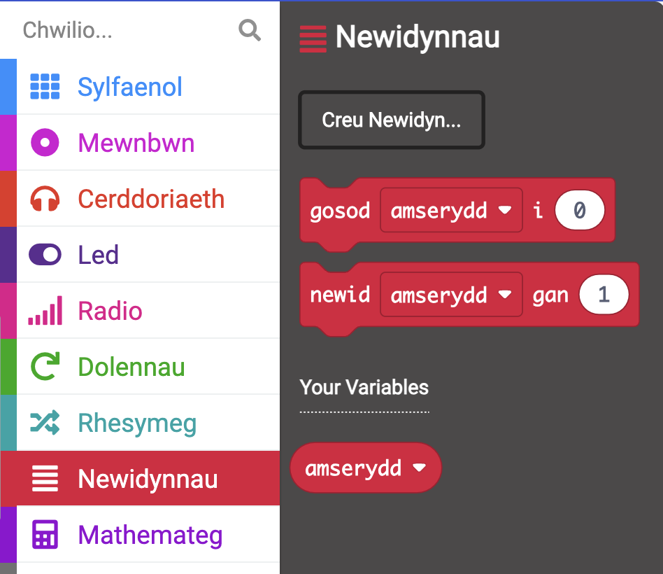

Mae'r **micro:bit** yn gyfrifiadur bach y gallwch ei ddefnyddio i ryngweithio â'r byd o'ch cwmpas.

Bydd y prosiect hwn yn eich helpu **ddarganfod** beth gall y **micro:bit** ei wneud.

### Beth fyddwch chi'n ei greu

Mae'r prosiect hwn yn eich atgoffa i wneud amser i fod yn wirion, cael hwyl, a gwneud ystum! Gallai hyn fod ar ôl diwrnod hir yn yr ysgol, neu fel ffordd o godi calon chi a'ch ffrindiau. Gallwch raglennu'r botymau micro:bit i'ch helpu i gofio cael ychydig o hwyl gwirion.

Yn y prosiect hwn, byddwch yn gwneud nodyn atgoffa **gwirion**.

Byddwch yn:
+ Arddangos eiconau, testun, a rhifau ar y LEDs
+ Defnyddiwch flociau <code style="background-color: #00A4A6">os</code> i reoli'r hyn sy'n cael ei arddangos
+ Defnyddiwch y bloc <code style="background-color: #1E90FF">saib</code> i greu amserydd cyfrif i lawr
+ Chwarae synau
+ Defnyddiwch fotymau i newid yr arddangosfa

--- no-print ---

### Chwarae ▶️

--- task ---

+ Beth sy'n digwydd pan fydd y rhaglen yn dechrau?
+ Beth sy'n digwydd pan fydd y cyfrif i lawr yn rhedeg?
+ Beth sy'n digwydd pan ddaw'r cyfrif lawr i ben?
+ Beth sy'n digwydd os `gwasgwch` Botwm A?
+ Beth sy'n digwydd os `gwasgwch` Botwm B?

<iframe style="position:absolute;top:0;left:0;width:100%;height:100%;" src="https://makecode.microbit.org/---run?id=_KiYLAWM3cip4" allowfullscreen="allowfullscreen" sandbox="allow-popups allow-forms allow-scripts allow-same-origin" frameborder="0"></iframe>

--- /task ---

--- /no-print ---

### Agor MakeCode

I ddechrau creu eich prosiect micro:bit, agorwch y golygydd MakeCode.

--- task ---

Agorwch y golygydd MakeCode yn [makecode.microbit.org](https://makecode.microbit.org)

--- collapse ---

---
title: Fersiwn all-lein o'r golygydd
---

Mae yna hefyd fersiwn [y gellir ei lawrlwytho o olygydd MakeCode](https://makecode.microbit.org/offline-app).

--- /collapse ---

--- /task ---

Unwaith y bydd y golygydd ar agor, crëwch Brosiect Newydd a rhowch enw i'ch prosiect.

--- task ---

Cliciwch ar y botwm **Prosiect Newydd**.

--- /task ---

--- task ---

Rhowch yr enw `nodyn atgoffa gwirion` i'ch prosiect a chliciwch **Creu**.

**Awgrym:** I wneud eich prosiect yn haws dod o hyd iddo yn nes ymlaen, rhowch enw defnyddiol iddo sy'n ymwneud â'r hyn rydych chi'n ei greu.

--- /task ---

### Golygydd MakeCode

Wedi'i greu gan y micro:bit Foundation, mae gan **olygydd MakeCode** bopeth sydd ei angen arnoch i ddechrau codio gyda micro:bit.

Ar yr ochr chwith. mae yna **efelychydd**. Micro:bit rhithwir yw hwn y gallwch ei ddefnyddio i brofi'ch cod!

Mae ganddo'r holl nodweddion a botymau a geir ar micro:bit V2, gan gynnwys:
+ Arddangosfa LED
+ Llefarydd
+ Meicroffon
+ Botymau mewnbwn
    + A
    + B
    + Logo

Yn y canol, mae **panel blociau**, sydd â chôd lliw ac sy'n eich galluogi i gael mynediad at flociau cod amrywiol.

Ar yr ochr dde, mae **panel golygydd cod**. Dyma lle rydych chi'n llusgo a gollwng blociau i greu eich rhaglen.

Mae panel golygydd MakeCode eisoes yn cynnwys dau floc: <code style="background-color: #1E90FF">ar y cychwyn</code> a <code style="background-color: #1E90FF">am byth</code>.

### Eicon arddangos

Byddwch yn defnyddio'r bloc <code style="background-color: #1E90FF">ar gychwyn</code> i weld sut mae'r LEDs ar yr efelychydd yn gweithio.

--- task ---

Cliciwch ar y ddewislen <code style="background-color: #1E90FF">Sylfaenol</code>.

Bydd hyn yn ehangu i ddangos y blociau sydd ar gael i chi.

Llusgwch y bloc <code style="background-color: #1E90FF">dangos eicon</code> bloc a'i osod **y tu mewn i** y bloc <code style="background-color: #1E90FF">ar ddechrau</code>.

Dylai hwn ffitio yn ei le fel darn pos.

<iframe style="position:relative;top:0;left:0;width:50%;height:100%;" src="https://makecode.microbit.org/---codeembed#pub:_ChCUrqPF77FM" allowfullscreen="allowfullscreen" frameborder="0" sandbox="allow-scripts allow-same-origin"></iframe>

--- /task ---

--- task ---

Cliciwch y saeth i lawr ar y bloc <code style="background-color: #1E90FF">danogs eicon</code> a dewiswch eicon.

Yn yr enghraifft hon, rydyn ni wedi dewis yr eicon `calon`.

--- /task ---

--- task ---

**Prawf:** Dylai'r dangosydd LED oleuo'r efelychydd, a dangos yr eicon a ddewiswyd gennych.

Da iawn! Rydych chi wedi gwneud i'r LEDs ar y micro:bit oleuo!

--- /task ---

### Dewiswch rai ystumiau

Bydd angen i chi benderfynu ar rai wynebau neu ystumiau gwirion y byddwch yn eu gwneud pryd bynnag y byddwch yn gwthio botwm micro:bit. Dyma rai syniadau ar gyfer ystumiau:

+ Gwên fawr gawslyd
+ Naid sêr
+ Byddwch yn goeden
+ Ystym ystwytho y cyhyrau

### Creu amserydd ar gyfer pob ystum

Creu newidyn a fydd yn cael ei ddefnyddio mewn amserydd sy'n dweud wrthych am ba mor hir i ddal pob ystum.

--- task ---

Agorwch y ddewislen <code style="background-color: #DC143C">Newidynnau</code>, a chliciwch **Gwneud newidyn**.

--- /task ---

--- task ---

Enwch y newidyn newydd `amserydd`, yna cliciwch ar y botwm **OK**.

--- /task ---

Bydd blociau newydd yn cael eu creu y gallwch eu gosod yn eich rhaglen i'w defnyddio a newid y gwerth sydd wedi'i storio yn y newidyn `amserydd`.

--- task ---

Llusgwch y <code style="background-color: #DC143C">set</code> bloc **o dan** y bloc <code style="background-color: #1E90FF">dangos eicon</code>.

<iframe style="position:relative;top:0;left:0;width:50%;height:100%;" src="https://makecode.microbit.org/---codeembed#pub:S59350-24192-35926-97900" allowfullscreen="allowfullscreen" frameborder="0" sandbox="allow-scripts allow-same-origin"></iframe>

--- /task ---

### Gosod eicon ar gyfer pob ystum

Byddwch nawr yn rhaglennu'r botymau mewnbwn A a B ar y micro:bit i'ch helpu i ddewis pa ystum gwirion i'w wneud.

--- task ---

Cliciwch ar y ddewislen <code style="background-color: #D400D4">Mewnbwn</code> a llusgwch bloc <code style="background-color: #D400D4">botwm ymlaen</code> i'r **panel golygydd cod**.

<iframe style="position:relative;top:0;left:0;width:50%;height:100%;" src="https://makecode.microbit.org/---codeembed#pub:_TUwcRCfFsHCb" allowfullscreen="allowfullscreen" frameborder="0" sandbox="allow-scripts allow-same-origin"></iframe>

--- /task ---

--- task ---

O'r ddewislen <code style="background-color: #1E90FF">Sylfaenol</code>, llusgwch y bloc <code style="background-color: #1E90FF">dangos leds</code> a'i osod tu fewn i'r bloc <code style="background-color: #D400D4">ar botwm</code>.

<iframe style="position:relative;top:0;left:0;width:55%;height:100%;" src="https://makecode.microbit.org/---codeembed#pub:_7Ugf5a3JXb81" allowfullscreen="allowfullscreen" frameborder="0" sandbox="allow-scripts allow-same-origin"></iframe>

Cliciwch ar y sgwariau i dynnu llun eich ystum. Bydd sgwariau gwyn yn cael eu goleuo ar yr arddangosfa LED.

Yn yr enghraifft hon, rydyn ni wedi tynnu llun wyneb gwên fel ystum gwirion.

<iframe style="position:relative;top:0;left:0;width:55%;height:100%;" src="https://makecode.microbit.org/---codeembed#pub:_XsR7jJ2wiTAx
" allowfullscreen="allowfullscreen" frameborder="0" sandbox="allow-scripts allow-same-origin"></iframe>

--- /task ---

Dylid arddangos yr eicon am beth amser cyn ei newid.

Byddwch yn defnyddio bloc <code style="background-color: #1E90FF">saib</code> ar gyfer hyn. Mae hyn yn oedi'r rhaglen am nifer penodol o filieiliadau (1/1000fed o eiliad).

--- task ---

O'r ddewislen <code style="background-color: #1E90FF">Sylfaenol</code>, llusgwch floc <code style="background-color: #1E90FF">saib</code> o dan y bloc <code style="background-color: #1E90FF">dangos leds</code>.

<iframe style="position:relative;top:0;left:0;width:55%;height:100%;" src="https://makecode.microbit.org/---codeembed#pub:_AVuUqsMq8hbR
" allowfullscreen="allowfullscreen" frameborder="0" sandbox="allow-scripts allow-same-origin"></iframe>

--- /task ---

--- task ---

Newidiwch y `100` yn y bloc <code style="background-color: #1E90FF">saib</code> i rif mwy fel bod y saib yn hirach, ac mae'r eicon yn cael ei arddangos am gyfnod hirach. Rydym wedi ei osod i 2 eiliad (`2000`) yn yr enghraifft hon.

<iframe style="position:relative;top:0;left:0;width:55%;height:100%;" src="https://makecode.microbit.org/---codeembed#pub:_2AcgfYKeAeFu
" allowfullscreen="allowfullscreen" frameborder="0" sandbox="allow-scripts allow-same-origin"></iframe>

--- /task ---

--- task ---

De-gliciwch ar y bloc <code style="background-color: #DC143C">set</code> y tu mewn i'r bloc <code style="background-color: #1E90FF">ar ddechrau</code>.

Cliciwch ar **Dyblyg** i wneud copi ohono.

Rhowch y bloc <code style="background-color: #DC143C">set</code> a ddyblygwyd uwchben y bloc <code style="background-color: #1E90FF">dangos leds</code>.

Newidiwch y `0` i `10` yn y bloc newydd.

--- /task ---

Er mwyn caniatáu dewis mwy nag un ystum, byddwch yn defnyddio Botwm B.

--- task ---

De-gliciwch ar y bloc cyfan <code style="background-color: #D400D4">ar fotwm</code>.

Cliciwch ar `Dyblygu` i wneud copi ohono.

Bydd nawr gennych ddau floc botwm <code style="background-color: #D400D4">ar fotwm</code> yn y **panel golygydd cod**.

--- /task ---

--- task ---

Cliciwch y saeth i lawr wrth ymyl y <code style="background-color: #D400D4">A</code> ar eich <code style="background-color: #D400D4">ar fotwm</code> dyblyg. Newidiwch y <code style="background-color: #D400D4">A</code> i <code style="background-color: #D400D4">B</code>.

--- /task ---

--- task ---

I greu eicon ystum newydd, newidiwch y sgwariau ar y bloc <code style="background-color: #1E90FF">show leds</code> y tu mewn i'r bloc <code style="background-color: #D400D4">ar fotwm</code> newydd.

--- /task ---

--- task ---

**Prawf**

+ Cliciwch ar Fotwm `A` ar yr efelychydd i weld pa eicon sy'n dangos ar y LED. Sylwch ar ba mor hir y mae'n dangos.
+ Gwnewch yr un peth i brofi Botwm `B`.
+ Newidiwch y gwerth yn eich bloc <code style="background-color: #1E90FF">saib</code> i gynyddu neu leihau faint o amser y dangosir yr eiconau ar bob gwasgwch botwm.

--- /task ---

### Creu cyfrif i lawr

Byddwch nawr yn creu cyfrif i lawr 10 eiliad.

Bydd gwerth newidiol <code style="background-color: #DC143C">amserydd</code> yn gostwng `1` bob eiliad, ond **dim ond** os yw'r amserydd **yn fwy na 0**.

--- task ---

O'r ddewislen <code style="background-color: #00A4A6">Logic</code>, llusgwch bloc <code style="background-color: #00A4A6">os</code>.

Rhowch ef yn y bloc <code style="background-color: #1E90FF">am byth</code>.

<iframe style="position:relative;top:0;left:0;width:50%;height:100%;" src="https://makecode.microbit.org/---codeembed#pub:_bbCWu0JRuH7u
" allowfullscreen="allowfullscreen" frameborder="0" sandbox="allow-scripts allow-same-origin"></iframe>

--- /task ---

--- task ---

O'r ddewislen <code style="background-color: #00A4A6">Logic</code>, llusgwch floc cymharu <code style="background-color: #00A4A6">0 = 0</code>.

Newidiwch y symbol <code style="background-color: #00A4A6">=</code> i <code style="background-color: #00A4A6">></code> (mwy na) gan ddefnyddio'r saeth gwympo ar y bloc cymharu.

Rhowch y bloc cymharu y tu mewn i'r bwlch <code style="background-color: #00A4A6">gwir</code> yn y bloc <code style="background-color: #00A4A6">os</code>.

<iframe style="position:relative;top:0;left:0;width:60%;height:100%;" src="https://makecode.microbit.org/---codeembed#pub:_5RoV5sKivV2q
" allowfullscreen="allowfullscreen" frameborder="0" sandbox="allow-scripts allow-same-origin"></iframe>

--- /task ---

--- task ---

O'r ddewislen <code style="background-color: #DC143C">Newidynnau</code>, llusgwch y bloc <code style="background-color: #DC143C">amserydd</code> a'i osod y tu mewn i'r `0` cyntaf yn y bloc <code style="background-color: #00A4A6">0 > 0</code>.

<iframe style="position:relative;top:0;left:0;width:50%;height:100%;" src="https://makecode.microbit.org/---codeembed#pub:_ChCUrqPF77FM" allowfullscreen="allowfullscreen" frameborder="0" sandbox="allow-scripts allow-same-origin"></iframe>0

--- /task ---

I greu cyfrif i lawr, mae angen lleihau gwerth newidiol `amserydd` gan `1`.

--- task ---

O'r ddewislen <code style="background-color: #DC143C">Newidynnau</code>, llusgwch y bloc <code style="background-color: #DC143C">change</code> a'i osod y tu mewn i'r adran <code style="background-color: #00A4A6">os</code>.

Newid `1` i `-1`.

<iframe style="position:relative;top:0;left:0;width:50%;height:100%;" src="https://makecode.microbit.org/---codeembed#pub:_ChCUrqPF77FM" allowfullscreen="allowfullscreen" frameborder="0" sandbox="allow-scripts allow-same-origin"></iframe>1

--- /task ---

--- task ---

O'r ddewislen <code style="background-color: #1E90FF">Sylfaenol</code>, llusgwch y bloc <code style="background-color: #1E90FF">dangos rhif</code> a'i osod o dan y bloc <code style="background-color: #DC143C">newid</code>.

O'r ddewislen <code style="background-color: #DC143C">Newidynnau</code>, llusgwch y newidyn <code style="background-color: #DC143C">amserydd</code> y tu mewn i'r `0` ar y bloc <code style="background-color: #1E90FF">dangos rhif</code>.

<iframe style="position:relative;top:0;left:0;width:50%;height:100%;" src="https://makecode.microbit.org/---codeembed#pub:_ChCUrqPF77FM" allowfullscreen="allowfullscreen" frameborder="0" sandbox="allow-scripts allow-same-origin"></iframe>2

--- /task ---

Ar ôl i bob gwerth o <code style="background-color: #DC143C">amserydd</code> gael ei arddangos ar y micro:bit, mae angen i chi ychwanegu saib o 1 eiliad.

--- task ---

Dde-gliciwch ar un o'ch blociau <code style="background-color: #1E90FF">saib</code> a'i ddyblu.

Llusgwch y bloc <code style="background-color: #1E90FF">saib</code> a ddyblygwyd o dan y bloc <code style="background-color: #1E90FF">dangos rhif</code>.

Newid `2000` i `1000`. 

<iframe style="position:relative;top:0;left:0;width:50%;height:100%;" src="https://makecode.microbit.org/---codeembed#pub:_ChCUrqPF77FM" allowfullscreen="allowfullscreen" frameborder="0" sandbox="allow-scripts allow-same-origin"></iframe>3

--- /task ---

Ar ôl i'r cyfrif i lawr ddod i ben, y gwerth fydd 0.

Mae angen neges arnoch i ddweud wrth y defnyddiwr am newid ei ystum gwirion.

Byddwch yn gwneud hyn drwy ychwanegu adran <code style="background-color: #00A4A6">arall</code> at y bloc <code style="background-color: #00A4A6">os</code>.

--- task ---

Cliciwch ar y symbol `+` ar waelod y bloc <code style="background-color: #00A4A6">os</code>. Bydd hyn yn creu adran <code style="background-color: #00A4A6">arall</code>.

O'r ddewislen <code style="background-color: #1E90FF">Sylfaenol</code>, llusgwch y bloc <code style="background-color: #1E90FF">dangos llinyn</code> a'i osod y tu mewn i'r adran <code style="background-color: #00A4A6">arall</code>.

Newidiwch y llinyn `Helo!` i `Osgo!`.

O'r ddewislen <code style="background-color: #1E90FF">Sylfaenol</code>, llusgwch y bloc <code style="background-color: #1E90FF">sgrin glir</code> a'i ollwng **uwchben** y bloc <code style="background-color: #1E90FF">dangos llinyn</code>.

<iframe style="position:relative;top:0;left:0;width:50%;height:100%;" src="https://makecode.microbit.org/---codeembed#pub:_ChCUrqPF77FM" allowfullscreen="allowfullscreen" frameborder="0" sandbox="allow-scripts allow-same-origin"></iframe>4

--- /task ---

--- collapse ---

---
title: Ychwanegu sain ar gyfer effaith ddramatig
---

O'r ddewislen <code style="background-color: #E63022">Music</code>, llusgwch bloc <code style="background-color: #E63022">chwarae tôn</code>.

Rhowch ef o dan y bloc <code style="background-color: #DC143C">newid</code>.

Cliciwch y gwymplen `Middle C` a bydd consol allweddi piano yn ymddangos.

Dewiswch tôn ar gyfer eich amserydd.

Rydym wedi dewis `Canol A`.

Cliciwch ar y gwymplen <code style="background-color: #E63022">nes gorffen</code> a'i newid i <code style="background-color: #E63022">yn y cefndir</code>.

<iframe style="position:relative;top:0;left:0;width:50%;height:100%;" src="https://makecode.microbit.org/---codeembed#pub:_ChCUrqPF77FM" allowfullscreen="allowfullscreen" frameborder="0" sandbox="allow-scripts allow-same-origin"></iframe>5

--- /collapse ---

--- task ---

**Profwch** eich rhaglen ar yr efelychydd:

+ **Cliciwch** Botwm A i weld yr eicon ystum sy'n cael ei arddangos.

+ **Cliciwch** Botwm B i weld eicon ystum arall yn cael ei arddangos.

+ **Gwiriwch** bod yr amserydd cyfrif i lawr yn gweithio ac yn cyfri yn ôl o 10.

+ **Gwiriwch** fod tôn yn cael ei chwarae wrth i bob eiliad gyfrif i lawr.

--- /task ---

--- task ---

[[[download-to-microbit]]]

--- /task ---

--- task ---

**Profwch** eich rhaglen ar y micro:bit ffisegol.

--- /task ---

### Uwchraddiwch eich prosiect

Gallwch chi uwchraddio'ch prosiect atgoffa gwirion trwy:

+ Ychwanegu un ystum gwirion arall sy'n dangos pryd rydych chi'n pwyso Botymau A a B gyda'i gilydd (`A+B`)
+ Cynyddu'r amser rhwng ystumiau