Το **micro:bit** είναι ένας μικρός υπολογιστής που μπορείς να χρησιμοποιήσεις για να αλληλεπιδράσεις με τον κόσμο γύρω σου.

Αυτό το έργο θα σε βοηθήσει να **ανακαλύψεις** τι μπορεί να κάνει το **micro:bit**.

### Τι θα φτιάξεις

Αυτό το έργο σου υπενθυμίζει να αφιερώσεις χρόνο για να χαλαρώσεις, να διασκεδάσεις και να κάνεις μια αστεία πόζα! Αυτό θα μπορούσε να συμβεί μετά από μια κουραστική μέρα στο σχολείο ή σαν ένας τρόπος για να φτιάξεις τη δική σου διάθεση και των φίλων σου. Μπορείς να προγραμματίσεις τα κουμπιά micro:bit για να σε βοηθήσουν να θυμάσαι να διασκεδάζεις με αστειάκια.

Σε αυτό το έργο, θα κάνεις μια **υπενθύμιση διασκέδασης**.

Θα:
+ Εμφανίσεις εικονίδια, κείμενα και αριθμούς στα LED
+ Χρησιμοποιήσεις μπλοκ `εάν`{:class='microbitlogic'} για να ελέγξεις τι εμφανίζεται
+ Χρησιμοποιήσεις το μπλοκ `παύση`{:class='microbitbasic'} για να δημιουργήσεις ένα χρονόμετρο αντίστροφης μέτρησης
+ Παίξεις ήχους
+ Χρησιμοποιήσεις κουμπιά για να αλλάξεις την οθόνη

--- no-print ---

### Δοκίμασέ το ▶️

--- task ---

+ Τι συμβαίνει όταν ξεκινά το πρόγραμμα;
+ Τι συμβαίνει όταν τρέχει η αντίστροφη μέτρηση;
+ Τι συμβαίνει όταν τελειώσει η αντίστροφη μέτρηση;
+ Τι θα συμβεί αν `πατήσεις` το κουμπί Button A;
+ Τι θα συμβεί αν `πατήσεις` το κουμπί Button B;

<div style="position:relative;height:100%;padding-bottom:125%;padding-top:0;overflow:hidden;">
<iframe style="position:absolute;top:0;left:0;width:100%;height:100%;" src="https://makecode.microbit.org/---run?id=_KiYLAWM3cip4" allowfullscreen="allowfullscreen" sandbox="allow-popups allow-forms allow-scripts allow-same-origin" frameborder="0"></iframe>
</div>

--- /task ---

--- /no-print ---

### Άνοιξε το MakeCode

Για να ξεκινήσεις τη δημιουργία του έργου σου με το micro:bit, πρέπει να ανοίξεις το πρόγραμμα επεξεργασίας MakeCode.

--- task ---

Άνοιξε το πρόγραμμα επεξεργασίας MakeCode στη διεύθυνση [makecode.microbit.org](https://makecode.microbit.org){:target="_blank"}

--- collapse ---

---
title: Εκτός σύνδεσης έκδοση του επεξεργαστή
---

Υπάρχει επίσης μια έκδοση με [δυνατότητα λήψης του προγράμματος επεξεργασίας MakeCode](https://makecode.microbit.org/offline-app)"{:target="_blank"}.

--- /collapse ---

--- /task ---

Μόλις ανοίξει το πρόγραμμα επεξεργασίας, δημιούργησε ένα νέο έργο και δώσε ένα όνομα στο έργο σου.

--- task ---

Κάνε κλικ στο κουμπί **Νέο έργο**.

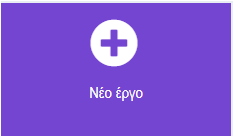

--- /task ---

--- task ---

Δώσε στο έργο σου το όνομα `Υπενθύμιση διασκέδασης` και κάνε κλικ στο **Δημιουργία**.

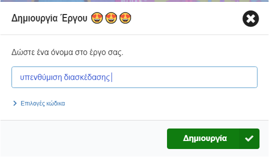

**Συμβουλή:** Για να γίνει πιο εύκολη η εύρεση του έργου σου αργότερα, δώσε του ένα όνομα που να σχετίζεται με αυτό που δημιουργείς.

--- /task ---

### Το πρόγραμμα επεξεργασίας MakeCode

Δημιουργημένο από το micro:bit Foundation, το πρόγραμμα επεξεργασίας **MakeCode** έχει όλα όσα χρειάζεσαι για να ξεκινήσεις να προγραμματίζεις με το micro:bit.

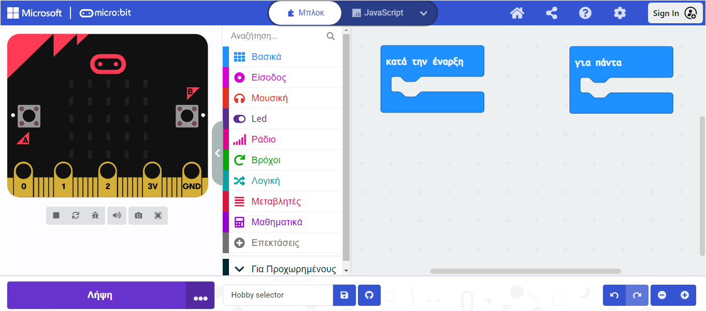

Στην αριστερή πλευρά. υπάρχει ένας προσομοιωτής ****. Αυτό είναι ένα εικονικό micro:bit που μπορείς να χρησιμοποιήσεις για να δοκιμάσεις τον κώδικά σου!

Διαθέτει όλα τα χαρακτηριστικά και τα κουμπιά που βρίσκονται σε ένα micro:bit V2, όπως:
+ Οθόνη LED
+ Ηχείο
+ Μικρόφωνο
+ Κουμπιά εισαγωγής
    + A
    + B
    + Λογότυπο (Logo)

Στο κέντρο, υπάρχει ο **πίνακας με τα μπλοκ**, ο οποίος είναι χρωματικά κωδικοποιημένος και σου επιτρέπει να έχεις πρόσβαση στα διάφορα μπλοκ κώδικα.

Στη δεξιά πλευρά, υπάρχει ο **πίνακας επεξεργασίας κώδικα**. Εδώ μπορείς να σύρεις και να αποθέσεις μπλοκ για να δημιουργήσεις το πρόγραμμά σου.

Το πρόγραμμα επεξεργασίας MakeCode περιέχει ήδη δύο μπλοκ: `κατά την έναρξη`{:class='microbitbasic'} και `για πάντα`{:class='microbitbasic'}.

### Εμφάνιση εικονιδίου

Θα χρησιμοποιήσεις το μπλοκ `κατά την έναρξη`{:class='microbitbasic'} για να δεις πώς λειτουργούν τα LED στον προσομοιωτή.

--- task ---

Κάνε κλικ στο μενού `Βασικά`{:class='microbitbasic'}.

Αυτό θα επεκταθεί για να σου δείξει τα διαθέσιμα μπλοκ.


Σύρε το μπλοκ `εμφάνιση εικονιδίου`{:class='microbitbasic'} και απόθεσέ το **μέσα** στο μπλοκ `κατά την έναρξη`{:class='microbitbasic'}.

Αυτό θα πρέπει να ταιριάζει στη θέση του σαν ένα κομμάτι παζλ.

```microbit
basic.showIcon(IconNames.Heart)
```

--- /task ---

--- task ---

Κάνε κλικ στο κάτω βέλος στο μπλοκ `εμφάνιση εικονιδίου`{:class='microbitbasic'} και επίλεξε ένα εικονίδιο.

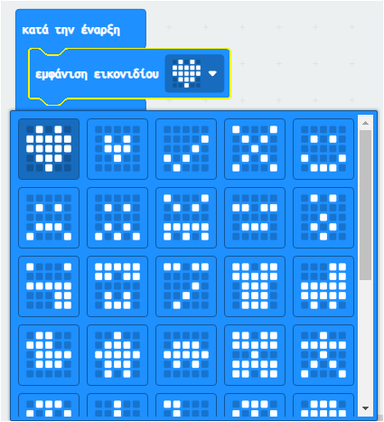

Σε αυτό το παράδειγμα, επιλέξαμε το εικονίδιο `καρδιά`.

--- /task ---

--- task ---

**Δοκιμή:** Η οθόνη LED θα πρέπει να ανάβει στον προσομοιωτή και να δείχνει το εικονίδιο που επέλεξες.

Συγχαρητήρια! Έκανες τα LED στο micro:bit να ανάβουν!

--- /task ---

### Επίλεξε μερικές πόζες

Θα χρειαστεί να αποφασίσεις μερικές αστείες γκριμάτσες ή πόζες που θα κάνεις κάθε φορά που πατάς ένα κουμπί micro:bit. Εδώ είναι μερικές ιδέες για πόζες:

+ Μια χαμογελαστή γκριμάτσα
+ Ασκήσεις γυμναστικής
+ Κάνε το δέντρο
+ Πόζα με κάμψη μυών (φλεξάρισμα)

### Δημιούργησε ένα χρονόμετρο για κάθε πόζα

Δημιούργησε μια μεταβλητή που θα χρησιμοποιηθεί σε ένα χρονόμετρο που θα σου λέει για πόσο χρόνο θα μείνεις στην κάθε πόζα.

--- task ---

Άνοιξε το μενού `Μεταβλητές`{:class="microbitvariables"} και κάνε κλικ στο κουμπί **Δημιουργία μεταβλητής**.

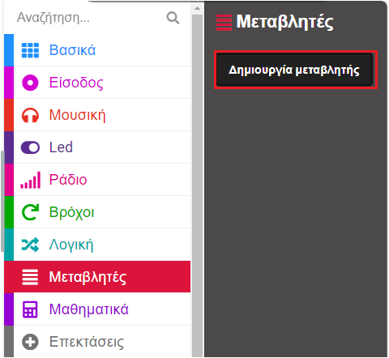

--- /task ---

--- task ---

Ονόμασε τη νέα μεταβλητή `χρονόμετρο` και, στη συνέχεια, κάνε κλικ στο κουμπί **OK**.

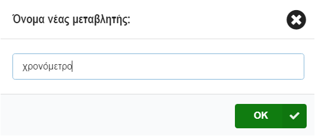

--- /task ---

Θα δημιουργηθούν νέα μπλοκ που μπορείς να τα τοποθετήσεις στο πρόγραμμά σου για να τα χρησιμοποιήσεις και να αλλάξεις την τιμή που είναι αποθηκευμένη στη μεταβλητή `χρονόμετρο`.

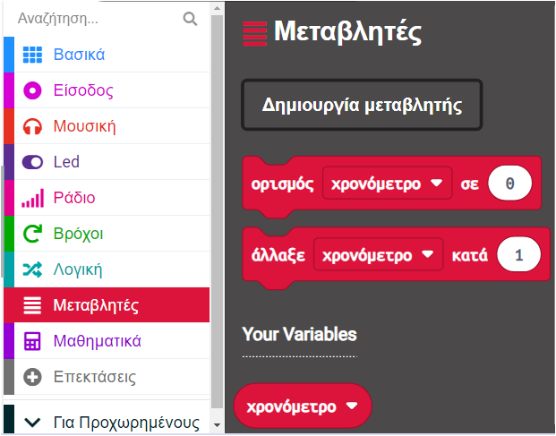

--- task ---

Σύρε το μπλοκ `ορισμός`{:class='microbitvariables'} **κάτω** από το μπλοκ `εμφάνιση εικονιδίου`{:class='microbitbasic'}.

```microbit
let χρονόμετρο = 0
basic.forever(function () {
    basic.showIcon(IconNames.Heart)
    χρονόμετρο = 0
})
```

--- /task ---

### Ορισμός εικονιδίου για κάθε πόζα

Τώρα θα προγραμματίσεις τα κουμπιά εισόδου Α και Β στο micro:bit για να σε βοηθήσει να επιλέξεις ποια αστεία πόζα να κάνεις.

--- task ---

Κάνε κλικ στο μενού `Είσοδος`{:class='microbitinput'} και σύρε ένα μπλοκ `όταν πιεστεί το πλήκτρο`{:class='microbitinput'} στον **πίνακα επεξεργαστή κώδικα**.

```microbit
input.onButtonPressed(Button.A, function () {

})
```

--- /task ---

--- task ---

Από το μενού `Βασικά`{:class='microbitbasic'}, σύρε το μπλοκ `show leds`{:class='microbitbasic'} μέσα στο μπλοκ `όταν πιεστεί το πλήκτρο`{:class='microbitinput'}.

```microbit
input.onButtonPressed(Button.A, function () {
    basic.showLeds(`
        . . . . .
        . . . . .
        . . . . .
        . . . . .
        . . . . .
        `)
})
```

Κάνε κλικ στα τετράγωνα για να σχεδιάσεις την πόζα σου. Λευκά τετράγωνα θα ανάψουν στο micro: bit.

Σε αυτό το παράδειγμα, έχουμε σχεδιάσει ένα χαμογελαστό πρόσωπο ως αστεία πόζα.

```microbit
input.onButtonPressed(Button.A, function () {
    basic.showLeds(`
        . # . # .
        . . . . .
        . . # . .
        # . . . #
        . # # # .
        `)
})
```

--- /task ---

Το εικονίδιο θα πρέπει να εμφανίζεται για κάποιο χρονικό διάστημα πριν να αλλάξει.

Θα χρησιμοποιήσεις ένα μπλοκ `παύση`{:class='microbitbasic'} για αυτό. Αυτό παύει το πρόγραμμα για ένα ορισμένο αριθμό χιλιοστών του δευτερολέπτου (1/1000ό του δευτερολέπτου).

--- task ---

Από το μενού `Βασικά`{:class='microbitbasic'}, σύρε ένα μπλοκ `παύση`{:class='microbitbasic'} κάτω από το μπλοκ `show leds`{:class='microbitbasic'}.

```microbit
input.onButtonPressed(Button.A, function () {
    basic.showLeds(`
        . # . # .
        . . . . .
        . . # . .
        # . . . #
        . # # # .
        `)
    basic.pause(100)
})
```

--- /task ---

--- task ---

Άλλαξε το μπλοκ `100` στο μπλοκ `παύση`{:class='microbitbasic'} σε ένα μεγαλύτερο αριθμό ώστε η παύση να είναι μεγαλύτερη, και το εικονίδιο να εμφανίζεται για μεγαλύτερο χρονικό διάστημα. Σε αυτό το παράδειγμα το έχουμε ορίσει σε 2 δευτερόλεπτα (`2000`).

```microbit
input.onButtonPressed(Button.A, function () {
    basic.showLeds(`
        . # . # .
        . . . . .
        . . # . .
        # . . . #
        . # # # .
        `)
    basic.pause(2000)
})
```

--- /task ---

--- task ---

Κάνε δεξί κλικ στο μπλοκ `ορισμός`{:class='microbitvariables'} μέσα στο μπλοκ `κατά την έναρξη`{:class='microbitbasic'}.

Κάνε κλικ στο **Αντίγραφο** για να δημιουργήσεις ένα αντίγραφό του.

Τοποέτησε το διπλότυπο μπλοκ `ορισμός`{:class='microbitvariables'} πάνω από το μπλοκ `show leds`{:class='microbitbasic'}.

Άλλαξε το `0` σε `10` στο νέο μπλοκ.

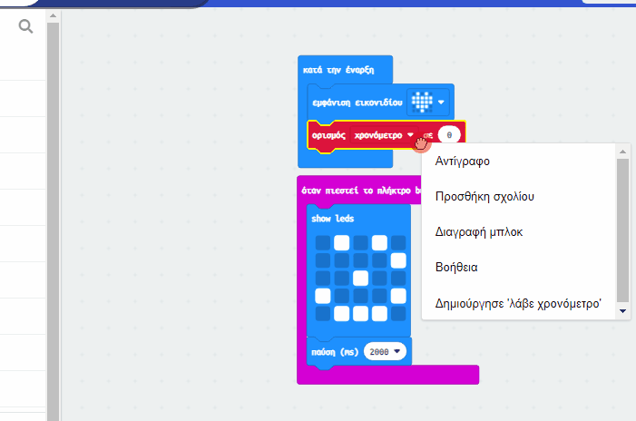

--- /task ---

Για να επιτρέψεις την επιλογή περισσότερων από μία πόζες, θα χρησιμοποιήσεις το κουμπί Button Β.

--- task ---

Κάνε δεξί κλικ σε ολόκληρο το μπλοκ `όταν πιεστεί το πλήκτρο`{:class='microbitinput'}.

Κάνε κλικ στο `Αντίγραφο` για να δημιουργήσεις ένα αντίγραφό του.

Τώρα θα έχεις δύο μπλοκ `όταν πιεστεί το πλήκτρο`{:class='microbitinput'} στον **πίνακα του επεξεργαστή κώδικα**.

--- /task ---

--- task ---

Κάνε κλικ στο κάτω βέλος δίπλα στο `A`{:class='microbitinput'} στο διπλότυπο μπλοκ `όταν πιεστεί το πλήκτρο`{:class='microbitinput'}. Άλλαξε το `A`{:class='microbitinput'} σε `B`{:class='microbitinput'}.

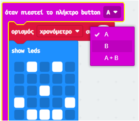

--- /task ---

--- task ---

Για να δημιουργήσεις ένα νέο εικονίδιο πόζας, άλλαξε τα τετράγωνα στο νέο μπλοκ `show leds`{:class='microbitbasic'} μέσα στο νέο μπλοκ `όταν πιεστεί το πλήκτρο`{:class='microbitinput'}.

--- /task ---

--- task ---

**Δοκιμή**

+ Κάνε κλικ στο κουμπί `A` στον προσομοιωτή για να δεις ποιο εικονίδιο εμφανίζεται στο LED. Σημείωσε για πόσο χρονικό διάστημα το δείχνει.
+ Κάνε το ίδιο για να δοκιμάσεις το κουμπί `B`.
+ Άλλαξε την τιμή στο μπλοκ `παύση`{:class='microbitbasic'} για να αυξήσεις ή να μειώσεις το χρόνο εμφάνισης των εικονιδίων σε κάθε πάτημα του κουμπιού.

--- /task ---

### Δημιουργία αντίστροφης μέτρησης

Τώρα θα δημιουργήσεις μια αντίστροφη μέτρηση 10 δευτερολέπτων.

Η τιμή της μεταβλητής `χρονόμετρο`{:class='microbitvariables'} θα μειώνεται κατά `1` κάθε δευτερόλεπτο, αλλά **μόνο** εάν το χρονόμετρο είναι **μεγαλύτερο από 0**.

--- task ---

Από το μενού `Λογική`{:class='microbitlogic'} σύρε το μπλοκ `εάν`{:class='microbitlogic'}.

Τοποθέτησέ το στο μπλοκ `για πάντα`{:class='microbitbasic'}.

```microbit
basic.forever(function () {
    if (true) {

    }
})
```

--- /task ---

--- task ---

Από το μενού `Λογική`{:class='microbitlogic'}, σύρε ένα μπλοκ σύγκρισης `0 = 0`{:class='microbitlogic'}.

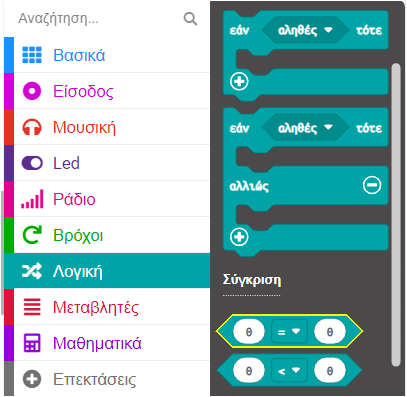

Άλλαξε το σύμβολο `=`{:class='microbitlogic'} σε `>`{:class='microbitlogic'} (μεγαλύτερο από) χρησιμοποιώντας το βέλος στο αναπτυσσόμενο μενού στο μπλοκ σύγκρισης.

Τοποθέτησε το μπλοκ σύγκρισης μέσα στο μπλοκ `αληθές`{:class='microbitlogic'} στο μπλοκ `εάν`{:class='microbitlogic'}.

```microbit
basic.forever(function () {
    if (0 > 0) {

    }
})
```

--- /task ---

--- task ---

Από το μενού `Μεταβλητές`{:class='microbitvariables'}, σύρε το μπλοκ `χρονόμετρο`{:class='microbitvariables'} και τοποθέτησέ το στο πρώτο μπλοκ `0` μέσα στο μπλοκ `0 > 0`{:class='microbitlogic'}.

```microbit
basic.forever(function () {
    let χρονόμετρο = 0
    if (χρονόμετρο > 0) {

    }
})
```

--- /task ---

Για να δημιουργήσεις μια αντίστροφη μέτρηση, η μεταβλητή `χρονόμετρο` πρέπει να μειωθεί κατά `1`.

--- task ---

Από το μενού `Μεταβλητές`{:class='microbitvariables'}, σύρε το μπλοκ `άλλαξε`{:class='microbitvariables'} και τοποθέτησέ το στην ενότητα `εάν`{:class='microbitlogic'}.

Άλλαξε το `1` σε `-1`.

```microbit
let χρονόμετρο = 0
basic.forever(function () {
    if (χρονόμετρο > 0) {
        χρονόμετρο += -1
    }
})
```

--- /task ---

--- task ---

Από το μενού `Βασικά`{:class='microbitbasic'}, σύρε το μπλοκ `εμφάνισε αριθμό`{:class='microbitbasic'} και τοποθέτησέ το κάτω από το μπλοκ `άλλαξε`{:class='microbitvariables'}.

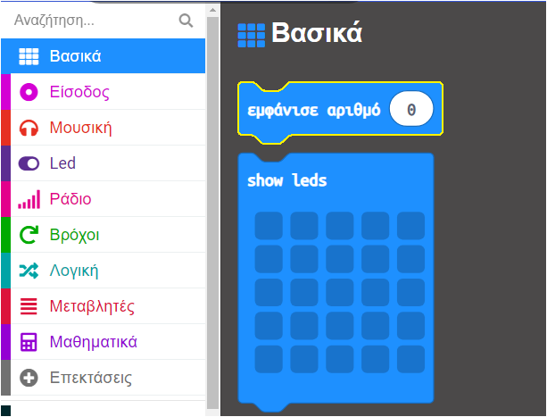

Από το μενού `Μεταβλητές`{:class='microbitvariables'}, σύρε τη μεταβλητή `χρονόμετρο`{:class='microbitvariables'} μέσα στο μπλοκ `0` στο μπλοκ `εμφάνισε αριθμό`{:class='microbitbasic'}.

```microbit
let χρονόμετρο = 0
basic.forever(function () {
    if (χρονόμετρο > 0) {
        χρονόμετρο += -1
        basic.showNumber(χρονόμετρο)
    }
})
```

--- /task ---

Αφού εμφανιστεί κάθε τιμή του `χρονόμετρου`{:class='microbitvariables'} στο micro:bit, πρέπει να προσθέσεις μια παύση 1 δευτερολέπτου.

--- task ---

Κάνε δεξί κλικ σε ένα από τα μπλοκ `παύση`{:class='microbitbasic'} και αντίγραψέ το.

Σύρε το διπλότυπο μπλοκ `παύση`{:class='microbitbasic'} κάτω από το μπλοκ `εμφάνιση αριθμό`{:class='microbitbasic'}.

Άλλαξε το `2000` σε `1000`.

```microbit
let χρονόμετρο = 0
basic.forever(function () {
    if (χρονόμετρο > 0) {
        χρονόμετρο += -1
        basic.showNumber(χρονόμετρο)
        basic.pause(1000)
    }
})
```

--- /task ---

Αφού τελειώσει η αντίστροφη μέτρηση, η τιμή θα είναι 0.

Χρειάζεσαι ένα μήνυμα για να πεις στον χρήστη να αλλάξει την αστεία πόζα του.

Θα το κάνεις αυτό προσθέτοντας μια ενότητα `αλλιώς`{:class='microbitlogic'} στο μπλοκ `εάν`{:class='microbitlogic'}.

--- task ---

Κάνε κλικ στο σύμβολο `+` κάτω από το μπλοκ `εάν`{:class='microbitlogic'}. Αυτό θα δημιουργήσει μια ενότητα `αλλιώς`{:class='microbitlogic'}.

Από το μενού `Βασικά`{:class='microbitbasic'}, σύρε το μπλοκ `εμφάνισε συμβολοσειρά`{:class='microbitbasic'} και τοποθέτησέ το μέσα στην ενότητα `αλλιώς`{:class='microbitlogic'}.

Άλλαξε τη συμβολοσειρά `Hello!` σε `Πόζα!`.

Από το μενού `Βασικά`{:class='microbitbasic'}, σύρε το μπλοκ `καθαρισμός οθόνης`{:class='microbitbasic'} και απόθεσέ το **πάνω** από το μπλοκ `εμφάνισε συμβολοσειρά`{:class='microbitbasic'}.

```microbit
let χρονόμετρο = 0
basic.forever(function () {
    if (χρονόμετρο > 0) {
        χρονόμετρο += -1
        basic.showNumber(χρονόμετρο)
        basic.pause(1000)
    } else {
        basic.clearScreen()
        basic.showString("Πόζα!")
    }
})
```

--- /task ---

--- collapse ---

---
title: Προσθήκη ήχου για έντονο εφέ
---

Από το μενού `Μουσική`{:class='microbitmusic'}, σύρε ένα μπλοκ `play tone`{:class='microbitmusic'}.

Τοποθέτησέ το κάτω από το μπλοκ `άλλαξε`{:class='microbitvariables'}.

Κάνε κλικ στο αναπτυσσόμενο μενού `Μεσαία Ντο` και θα εμφανιστεί μια κονσόλα πλήκτρων πιάνου.

Επίλεξε έναν τόνο για το χρονόμετρό σου.

Έχουμε επιλέξει `Μεσαία Λα`.

Κάνε κλικ στο `until done`{:class='microbitmusic'} αναπτυσσόμενο μενού και άλλαξέ το σε `in background`{:class='microbitmusic'}.

```microbit
let χρονόμετρο = 0
basic.forever(function () {
    if (χρονόμετρο > 0) {
        χρονόμετρο += -1
        music.play(music.tonePlayable(440, music.beat(BeatFraction.Whole)), music.PlaybackMode.InBackground)
        basic.showNumber(χρονόμετρο)
        basic.pause(1000)
    } else {
        basic.clearScreen()
        basic.showString("Πόζα!")
    }
})
```

--- /collapse ---

--- task ---

**Δοκίμασε** το πρόγραμμά σου στον προσομοιωτή:

+ **Κάνε κλικ** στο Κουμπί A για να δεις το εικονίδιο πόζας να εμφανίζεται.

+ **Κάνε κλικ** στο Κουμπί Β για να δεις ένα άλλο εικονίδιο πόζας να εμφανίζεται.

+ **Έλεγξε** ότι το χρονόμετρο αντίστροφης μέτρησης λειτουργεί και μετρά αντίστροφα από το 10.

+ **Έλεγξε** ότι ακούγεται ένας τόνος καθώς κάθε δευτερόλεπτο μετρά αντίστροφα.

--- /task ---

--- task ---

[[[download-to-microbit]]]

Όταν κατεβάσεις το πρόγραμμά σου στο micro:bit, θα εκτελεστεί αμέσως.

--- /task ---

--- task ---

**Δοκίμασε** το πρόγραμμά σου στο πραγματικό micro:bit.

--- /task ---

[[[microbit-share]]]

### Ολοκληρωμένο έργο

Αν θέλεις να ελέγξεις τον κώδικά σου μπορείς να βρεις [το ολοκληρωμένο έργο εδώ](https://makecode.microbit.org/_8K430qR3oH7t){:target="_blank"}.

### Αναβάθμισε το έργο σου

Μπορείς να αναβαθμίσεις το έργο σου υπενθύμιση διασκέδασης:

+ Προσθέτοντας μια ακόμη αστεία πόζα που να εμφανίζεται όταν πατάς τα κουμπιά A και B μαζί (`A+B`)
+ Αυξάνοντας το χρονικό διάστημα ανάμεσα στις πόζες

***

Το έργο αυτό μεταφράστηκε από τους εθελοντές:

Σταυρούλα Μισθού
Μάνος Ζεάκης

Χάρη στους εθελοντές, μπορούμε να δώσουμε σε ανθρώπους σε όλο τον κόσμο την ευκαιρία να μάθουν στη γλώσσα τους. Μπορείτε να μας βοηθήσετε να προσεγγίσουμε περισσότερους ανθρώπους μεταφράζοντας εθελοντικά - περισσότερες πληροφορίες στο [rpf.io/translate](https://rpf.io/translate).