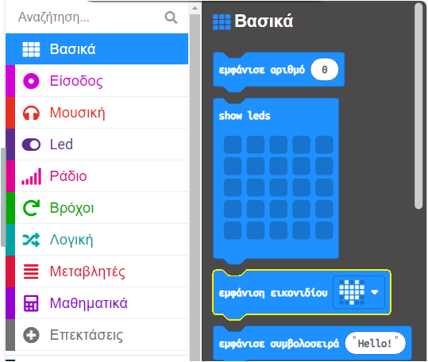

Το **micro:bit** είναι ένας μικρός υπολογιστής που μπορείς να χρησιμοποιήσεις για να αλληλεπιδράσεις με τον κόσμο γύρω σου.

Αυτό το έργο θα σε βοηθήσει να **ανακαλύψεις** τι μπορεί να κάνει το **micro:bit**.

### Τι θα φτιάξεις

Αυτό το έργο σου υπενθυμίζει να αφιερώσεις χρόνο για να χαλαρώσεις, να διασκεδάσεις και να κάνεις μια αστεία πόζα! Αυτό θα μπορούσε να συμβεί μετά από μια κουραστική μέρα στο σχολείο ή σαν ένας τρόπος για να φτιάξεις τη δική σου διάθεση και των φίλων σου. Μπορείς να προγραμματίσεις τα κουμπιά micro:bit για να σε βοηθήσουν να θυμάσαι να διασκεδάζεις με αστειάκια.

Σε αυτό το έργο, θα κάνεις μια **υπενθύμιση διασκέδασης**.

Θα:
+ Εμφανίσεις εικονίδια, κείμενα και αριθμούς στα LED
+ Χρησιμοποιήσεις μπλοκ `εάν`{:class='microbitlogic'} για να ελέγξεις τι εμφανίζεται
+ Χρησιμοποιήσεις το μπλοκ `παύση`{:class='microbitbasic'} για να δημιουργήσεις ένα χρονόμετρο αντίστροφης μέτρησης
+ Παίξεις ήχους
+ Χρησιμοποιήσεις κουμπιά για να αλλάξεις την οθόνη

--- no-print ---

### Δοκίμασέ το ▶️

--- task ---

+ Τι συμβαίνει όταν ξεκινά το πρόγραμμα;
+ Τι συμβαίνει όταν τρέχει η αντίστροφη μέτρηση;
+ Τι συμβαίνει όταν τελειώσει η αντίστροφη μέτρηση;
+ Τι θα συμβεί αν `πατήσεις` το κουμπί Button A;
+ Τι θα συμβεί αν `πατήσεις` το κουμπί Button B;

<div style="position:relative;height:100%;padding-bottom:125%;padding-top:0;overflow:hidden;">
<iframe style="position:absolute;top:0;left:0;width:100%;height:100%;" src="https://makecode.microbit.org/---run?id=_KiYLAWM3cip4" allowfullscreen="allowfullscreen" sandbox="allow-popups allow-forms allow-scripts allow-same-origin" frameborder="0"></iframe>
</div>

--- /task ---

--- /no-print ---

### Άνοιξε το MakeCode

Για να ξεκινήσεις τη δημιουργία του έργου σου με το micro:bit, πρέπει να ανοίξεις το πρόγραμμα επεξεργασίας MakeCode.

--- task ---

Άνοιξε το πρόγραμμα επεξεργασίας MakeCode στη διεύθυνση [makecode.microbit.org](https://makecode.microbit.org){:target="_blank"}

--- collapse ---

---
title: Εκτός σύνδεσης έκδοση του επεξεργαστή
---

Υπάρχει επίσης μια έκδοση με [δυνατότητα λήψης του προγράμματος επεξεργασίας MakeCode](https://makecode.microbit.org/offline-app)"{:target="_blank"}.

--- /collapse ---

--- /task ---

Μόλις ανοίξει το πρόγραμμα επεξεργασίας, δημιούργησε ένα νέο έργο και δώσε ένα όνομα στο έργο σου.

--- task ---

Κάνε κλικ στο κουμπί **Νέο έργο**.


--- /task ---

--- task ---

Δώσε στο έργο σου το όνομα `Υπενθύμιση διασκέδασης` και κάνε κλικ στο **Δημιουργία**.


**Συμβουλή:** Για να γίνει πιο εύκολη η εύρεση του έργου σου αργότερα, δώσε του ένα όνομα που να σχετίζεται με αυτό που δημιουργείς.

--- /task ---

### Το πρόγραμμα επεξεργασίας MakeCode

Δημιουργημένο από το micro:bit Foundation, το πρόγραμμα επεξεργασίας **MakeCode** έχει όλα όσα χρειάζεσαι για να ξεκινήσεις να προγραμματίζεις με το micro:bit.


Στην αριστερή πλευρά. υπάρχει ένας προσομοιωτής ****. Αυτό είναι ένα εικονικό micro:bit που μπορείς να χρησιμοποιήσεις για να δοκιμάσεις τον κώδικά σου!

Διαθέτει όλα τα χαρακτηριστικά και τα κουμπιά που βρίσκονται σε ένα micro:bit V2, όπως:
+ Οθόνη LED
+ Ηχείο
+ Μικρόφωνο
+ Κουμπιά εισαγωγής
    + A
    + B
    + Λογότυπο (Logo)

Στο κέντρο, υπάρχει ο **πίνακας με τα μπλοκ**, ο οποίος είναι χρωματικά κωδικοποιημένος και σου επιτρέπει να έχεις πρόσβαση στα διάφορα μπλοκ κώδικα.

Στη δεξιά πλευρά, υπάρχει ο **πίνακας επεξεργασίας κώδικα **. Εδώ μπορείς να σύρεις και να αποθέσεις μπλοκ για να δημιουργήσεις το πρόγραμμά σου.

Το πρόγραμμα επεξεργασίας MakeCode περιέχει ήδη δύο μπλοκ: `κατά την έναρξη`{:class='microbitbasic'} και `για πάντα`{:class='microbitbasic'}.

### Εμφάνιση εικονιδίου

Θα χρησιμοποιήσεις το μπλοκ `κατά την έναρξη`{:class='microbitbasic'} για να δεις πώς λειτουργούν τα LED στον προσομοιωτή.

--- task ---

Κάνε κλικ στο μενού `Βασικά`{:class='microbitbasic'}.

Αυτό θα επεκταθεί για να σου δείξει τα διαθέσιμα μπλοκ.



Σύρε το μπλοκ `εμφάνιση εικονιδίου`{:class='microbitbasic'} και απόθεσέ το **μέσα** στο μπλοκ `κατά την έναρξη`{:class='microbitbasic'}.

Αυτό θα πρέπει να ταιριάζει στη θέση του σαν ένα κομμάτι παζλ.

```microbit
basic.showIcon(IconNames.Heart)
```

--- /task ---

--- task ---

Κάνε κλικ στο κάτω βέλος στο μπλοκ `εμφάνιση εικονιδίου`{:class='microbitbasic'} και επίλεξε ένα εικονίδιο.


Σε αυτό το παράδειγμα, επιλέξαμε το εικονίδιο `καρδιά`.

--- /task ---

--- task ---

**Δοκιμή:** Η οθόνη LED θα πρέπει να ανάβει στον προσομοιωτή και να δείχνει το εικονίδιο που επίλεξες.

Συγχαρητήρια! Έκανες τα LED στο micro:bit να ανάβουν!

--- /task ---

### Επίλεξε μερικές πόζες

Θα χρειαστεί να αποφασίσεις μερικές αστείες γκριμάτσες ή πόζες που θα κάνεις κάθε φορά που πατάς ένα κουμπί micro:bit. Εδώ είναι μερικές ιδέες για πόζες:

+ Μια γκριμάτσα βαρεμάρας
+ Ασκήσεις γυμναστικής
+ Κάνε το δέντρο
+ Πόζα με κάμψη μυών

### Δημιούργησε ένα χρονόμετρο για κάθε πόζα

Create a variable that will be used in a timer that tells you how long to hold each pose for.

--- task ---

Open the `Variables`{:class='microbitvariables'} menu, and click **Make a variable**.


--- /task ---

--- task ---

Name the new variable `timer`, then click the **OK** button.


--- /task ---

New blocks will be created that you can place in your program to use and change the value stored in the `timer` variable.


--- task ---

Drag the `set`{:class='microbitvariables'} block **under** the `show icon`{:class='microbitbasic'} block.

```microbit
let timer = 0
basic.forever(function () {
    basic.showIcon(IconNames.Heart)
    timer = 0
})
```

--- /task ---

### Set icon for each pose

You will now program the A and B input buttons on the micro:bit to help you select which silly pose to do.

--- task ---

Click on the `Input`{:class='microbitinput'} menu and drag an `on button`{:class='microbitinput'} block to the **code editor panel**.

```microbit
input.onButtonPressed(Button.A, function () {

})
```

--- /task ---

--- task ---

From the `Basic`{:class='microbitbasic'} menu, drag the `show leds`{:class='microbitbasic'} block inside the `on button`{:class='microbitinput'} block.

```microbit
input.onButtonPressed(Button.A, function () {
    basic.showLeds(`
        . . . . .
        . . . . .
        . . . . .
        . . . . .
        . . . . .
        `)
})
```

Click on the squares to draw your pose. Whites squares will be lit on the LED display.

In this example, we have drawn a smiley face as a silly pose.

```microbit
input.onButtonPressed(Button.A, function () {
    basic.showLeds(`
        . # . # .
        . . . . .
        . . # . .
        # . . . #
        . # # # .
        `)
})
```

--- /task ---

The icon should be displayed for some time before changing.

You will use a `pause`{:class='microbitbasic'} block for this. This pauses the program for a set number of milliseconds (1/1000th of a second).

--- task ---

From the `Basic`{:class='microbitbasic'} menu, drag a `pause`{:class='microbitbasic'} block below the `show leds`{:class='microbitbasic'} block.

```microbit
input.onButtonPressed(Button.A, function () {
    basic.showLeds(`
        . # . # .
        . . . . .
        . . # . .
        # . . . #
        . # # # .
        `)
    basic.pause(100)
})
```

--- /task ---

--- task ---

Change the `100` in the `pause`{:class='microbitbasic'} block to a larger number so the pause is longer, and the icon is displayed for longer. We have set it to 2 seconds (`2000`) in this example.

```microbit
input.onButtonPressed(Button.A, function () {
    basic.showLeds(`
        . # . # .
        . . . . .
        . . # . .
        # . . . #
        . # # # .
        `)
    basic.pause(2000)
})
```

--- /task ---

--- task ---

Right-click on the `set`{:class='microbitvariables'} block inside the `on start`{:class='microbitbasic'} block.

Click **Duplicate** to make a copy of it.

Place the duplicated `set`{:class='microbitvariables'} block above the `show leds`{:class='microbitbasic'} block.

Change the `0` to `10` in the new block.


--- /task ---

To allow more than one pose to be selected, you will use Button B.

--- task ---

Right-click on the entire `on button`{:class='microbitinput'} block.

Click `Duplicate` to make a copy of it.

You will now have two `on button`{:class='microbitinput'} blocks in the **code editor panel**.

--- /task ---

--- task ---

Click the down arrow next to the `A`{:class='microbitinput'} on your duplicated `on button`{:class='microbitinput'} block. Change the `A`{:class='microbitinput'} to `B`{:class='microbitinput'}.


--- /task ---

--- task ---

To create a new pose icon, change the squares on the new `show leds`{:class='microbitbasic'} block inside the new `on button`{:class='microbitinput'} block.

--- /task ---

--- task ---

**Test**

+ Click Button `A` on the simulator to see which icon displays on the LED. Take note of how long it shows for.
+ Do the same to test Button `B`.
+ Change the value in your `pause`{:class='microbitbasic'} block to increase or decrease how much time the icons are shown for on each button press.

--- /task ---

### Create a countdown

You will now create a 10-second countdown.

The `timer`{:class='microbitvariables'} variable value will decrease by `1` each second, but **only** if the timer is **greater than 0**.

--- task ---

From the `Logic`{:class='microbitlogic'} menu, drag an `if`{:class='microbitlogic'} block.

Place it in the `forever`{:class='microbitbasic'} block.

```microbit
basic.forever(function () {
    if (true) {

    }
})
```

--- /task ---

--- task ---

From the `Logic`{:class='microbitlogic'} menu, drag a `0 = 0`{:class='microbitlogic'} comparison block.


Change the `=`{:class='microbitlogic'} to a `>`{:class='microbitlogic'} (greater than) symbol using the drop-down arrow on the comparison block.

Place the comparison block inside the `true`{:class='microbitlogic'} space in the `if`{:class='microbitlogic'} block.

```microbit
basic.forever(function () {
    if (0 > 0) {

    }
})
```

--- /task ---

--- task ---

From the `Variables`{:class='microbitvariables'} menu, drag the `timer`{:class='microbitvariables'} block and place it inside the first `0` in the `0 > 0`{:class='microbitlogic'} block.

```microbit
basic.forever(function () {
    let timer = 0
    if (timer > 0) {

    }
})
```

--- /task ---

To create a countdown, the `timer` variable value needs to reduce by `1`.

--- task ---

From the `Variables`{:class='microbitvariables'} menu, drag the `change`{:class='microbitvariables'} block and place it inside the `if`{:class='microbitlogic'} section.

Change `1` to `-1`.

```microbit
let timer = 0
basic.forever(function () {
    if (timer > 0) {
        timer += -1
    }
})
```

--- /task ---

--- task ---

From the `Basic`{:class='microbitbasic'} menu, drag the `show number`{:class='microbitbasic'} block and place it below the `change`{:class='microbitvariables'} block.


From the `Variables`{:class='microbitvariables'} menu, drag the `timer`{:class='microbitvariables'} variable inside the `0` on the `show number`{:class='microbitbasic'} block.

```microbit
let timer = 0
basic.forever(function () {
    if (timer > 0) {
        timer += -1
        basic.showNumber(timer)
    }
})
```

--- /task ---

After each value of `timer`{:class='microbitvariables'} is displayed on the micro:bit, you need to add a 1-second pause.

--- task ---

Right-click on one of your `pause`{:class='microbitbasic'} blocks and duplicate it.

Drag the duplicated `pause`{:class='microbitbasic'} block below the `show number`{:class='microbitbasic'} block.

Change `2000` to `1000`.

```microbit
let timer = 0
basic.forever(function () {
    if (timer > 0) {
        timer += -1
        basic.showNumber(timer)
        basic.pause(1000)
    }
})
```

--- /task ---

After the countdown finishes, the value will be 0.

You need a message to tell the user to change their silly pose.

You will do this by adding an `else`{:class='microbitlogic'} section to the `if`{:class='microbitlogic'} block.

--- task ---

Click on the `+` symbol at the bottom of the `if`{:class='microbitlogic'} block. This will create an `else`{:class='microbitlogic'} section.

From the `Basic`{:class='microbitbasic'} menu, drag the `show string`{:class='microbitbasic'} block and place it inside the `else`{:class='microbitlogic'} section.

Change the string `Hello!` to `Pose!`.

From the `Basic`{:class='microbitbasic'} menu, drag the `clear screen`{:class='microbitbasic'} block and drop it **above** the `show string`{:class='microbitbasic'} block.

```microbit
let timer = 0
basic.forever(function () {
    if (timer > 0) {
        timer += -1
        basic.showNumber(timer)
        basic.pause(1000)
    } else {
        basic.clearScreen()
        basic.showString("Pose!")
    }
})
```

--- /task ---

--- collapse ---

---
title: Add sound for dramatic effect
---

From the `Music`{:class='microbitmusic'} menu, drag a `play tone`{:class='microbitmusic'} block.

Place it below the `change`{:class='microbitvariables'} block.

Click the `Middle C` drop-down menu and a piano keys console will appear.

Choose a tone for your timer.

We have selected `Middle A`.

Click the `until done`{:class='microbitmusic'} drop-down menu and change it to `in background`{:class='microbitmusic'}.

```microbit
let timer = 0
basic.forever(function () {
    if (timer > 0) {
        timer += -1
        music.play(music.tonePlayable(440, music.beat(BeatFraction.Whole)), music.PlaybackMode.InBackground)
        basic.showNumber(timer)
        basic.pause(1000)
    } else {
        basic.clearScreen()
        basic.showString("Pose!")
    }
})
```

--- /collapse ---

--- task ---

**Test** your program on the simulator:

+ **Click** Button A to see the pose icon displayed.

+ **Click** Button B to see another pose icon displayed.

+ **Check** the countdown timer is working and counting back from 10.

+ **Check** that a tone is played as each second counts down.

--- /task ---

--- task ---

[[[download-to-microbit]]]

When you have downloaded your program to your micro:bit, it will run immediately.

--- /task ---

--- task ---

**Test** your program on the physical micro:bit.

--- /task ---

[[[microbit-share]]]

### Completed project

If you want to check your code you can can find [the completed project here](https://makecode.microbit.org/_8K430qR3oH7t){:target="_blank"}.

### Upgrade your project

You can upgrade your silly reminder project by:

+ Adding one more silly pose that shows when you press Buttons A and B together (`A+B`)
+ Increase the amount of time between poses