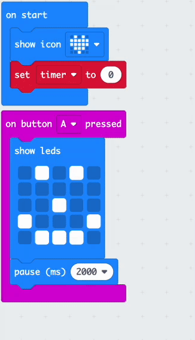

The **micro:bit** is a small computer that you can use to interact with the world around you.

This project will help you **discover** what the **micro:bit** can do before you go on to explore it in more detail. 

### What you will make

Here's a project to remind you to loosen up and strike a pose! This could be after a long day at school, or a way to cheer you and your friends up. You can program the micro:bit buttons to help you remember to have some silly fun.

In this project you are going to make a **silly reminder**. 

You will: 
+ Display icons, text and numbers on the LEDs
+ Use <code style="background-color: #00A4A6">if</code> blocks to control what is displayed
+ Use the <code style="background-color: #1E90FF">pause</code> block to create a countdown timer
+ Play sounds
+ Use buttons to change the display

--- no-print ---

### Play ▶️

--- task ---

+ What happens when the program starts?
+ What happens when the countdown runs?
+ What happens when the countdown finishes?
+ What happens if you `press` Button A?
+ What happens if you `press` Button A?

<iframe style="position:absolute;top:0;left:0;width:100%;height:100%;" src="https://makecode.microbit.org/---run?id=_WRMV6RCMU5Fb" allowfullscreen="allowfullscreen" sandbox="allow-popups allow-forms allow-scripts allow-same-origin" frameborder="0"></iframe>

--- /task ---

--- /no-print ---

### Opening MakeCode

To get started creating your micro:bit project, open the MakeCode editor.

--- task ---

Open the MakeCode editor at [makecode.microbit.org](https://makecode.microbit.org)

--- collapse ---

---
title: Offline version of the editor
---

There is also a [downloadable version of the MakeCode editor](https://makecode.microbit.org/offline-app).

--- /collapse ---

--- /task ---

Once the editor is open, create a New Project and give your project a name. 

--- task ---

Click on the **New Project** button.

--- /task ---

--- task ---

Create your project with the name `silly reminder` and click **Create**.

**Tip:** Give your project a helpful name that relates to the activity you’re creating. This will make it easier to find if you create other projects on MakeCode.

--- /task ---

### The MakeCode Editor

Created by the micro:bit Foundation, the **MakeCode editor** has everything you need to get started coding on micro:bit. 

On the left side there is a **simulator**, this contains a virtual micro:bit that you can use to test your code! 

It has all the features and buttons found on a V2 micro:bit, including:
+ LED display
+ Speaker
+ Microphone
+ Input buttons
    + A
    + B
    + Logo

In the centre there is the **blocks panel** which is colour-coded and allows you to access various code blocks.

On the right side is the **code editor panel** to drag and drop blocks into when creating your program.

The MakeCode editor panel already contains two blocks: <code style="background-color: #1E90FF">on start</code> and <code style="background-color: #1E90FF">forever</code>.

### Display Icon

You will use the <code style="background-color: #1E90FF">on start</code> block to see how the LEDs on the simulator work.

--- task ---

Click on the <code style="background-color: #1E90FF">Basic</code> menu. 

This will expand to show you the blocks available.

Drag the <code style="background-color: #1E90FF">show icon</code> block and place it **inside** the <code style="background-color: #1E90FF">on start</code> block. 

This should fit in place like a puzzle.

<iframe style="position:relative;top:0;left:0;width:50%;height:50%;" src="https://makecode.microbit.org/---codeembed#pub:_iVKhocCVxR3f" allowfullscreen="allowfullscreen" frameborder="0" sandbox="allow-scripts allow-same-origin"></iframe>

--- /task ---

--- task ---

Click the down arrow on the <code style="background-color: #1E90FF">show icon</code> block and choose any icon of your choice.

In this example, we have chosen the `heart` icon.

--- /task ---

--- task ---

**Test:** 
The LED display should light up on the simulator, showing your chosen icon.

Well done for getting the LEDs on the micro:bit to light up!

--- /task ---

### Choose some poses

You will need to decide which silly faces/poses you will make whenever you push a micro:bit button. Here are some ideas for poses:

+ A big cheesy grin
+ Jumping jacks
+ Be a tree
+ Flexing muscle pose

### Create a timer for each pose

Create a variable that will be used in a timer for how long you should hold each pose.

--- task ---

Open the <code style="background-color: #DC143C">Variables</code> menu, and click **Make a variable**.

--- /task ---

--- task ---

Name the new variable `timer`, then click the `Ok` button.

--- /task ---

New blocks will be created that you can place in your program to use and change the value stored in the `timer` variable. 

--- task ---

Drag the <code style="background-color: #DC143C">set</code> block inside the <code style="background-color: #1E90FF">on start</code> block and change the `0` to `10`.

<iframe style="position:relative;top:0;left:0;width:55%;height:55%;" src="https://makecode.microbit.org/---codeembed#pub:_f4yMbPEpHFwv" allowfullscreen="allowfullscreen" frameborder="0" sandbox="allow-scripts allow-same-origin"></iframe>

--- /task ---

### Set icon for each pose

You will now program the A and B input buttons on the micro:bit to help you select an icon for each pose.

--- task ---

Click on the <code style="background-color: #D400D4">Input</code> menu and drag out an <code style="background-color: #D400D4">on button</code> block to the **code editor panel**.

<iframe style="position:relative;top:0;left:0;width:50%;height:100%;" src="https://makecode.microbit.org/---codeembed#pub:_TUwcRCfFsHCb" allowfullscreen="allowfullscreen" frameborder="0" sandbox="allow-scripts allow-same-origin"></iframe>

--- /task ---

--- task ---

From the <code style="background-color: #1E90FF">Basic</code> menu, drag the <code style="background-color: #1E90FF">show leds</code> block inside the <code style="background-color: #D400D4">on button</code> block.

<iframe style="position:relative;top:0;left:0;width:75%;height:75%;" src="https://makecode.microbit.org/---codeembed#pub:_7Ugf5a3JXb81" allowfullscreen="allowfullscreen" frameborder="0" sandbox="allow-scripts allow-same-origin"></iframe>

Click on each of the squares to draw your pose. 

In this example, we have drawn a smiley face as a silly pose.

<iframe style="position:relative;top:0;left:0;width:75%;height:75%;" src="https://makecode.microbit.org/---codeembed#pub:_XsR7jJ2wiTAx
" allowfullscreen="allowfullscreen" frameborder="0" sandbox="allow-scripts allow-same-origin"></iframe>

--- /task ---

The icon should be displayed for some time before changing. 

You will use a <code style="background-color: #1E90FF">pause</code> block for this. This is a set number of milliseconds (1/1000th of a second).

--- task ---

From the <code style="background-color: #1E90FF">Basic</code> menu, drag a <code style="background-color: #1E90FF">pause</code> block below the <code style="background-color: #1E90FF">show leds</code> block.

<iframe style="position:relative;top:0;left:0;width:75%;height:75%;" src="https://makecode.microbit.org/---codeembed#pub:_AVuUqsMq8hbR
" allowfullscreen="allowfullscreen" frameborder="0" sandbox="allow-scripts allow-same-origin"></iframe>

--- /task ---

--- task ---

Change the 100 in the <code style="background-color: #1E90FF">pause</code> block to a longer time, so the icon can be displayed for longer. We have set it to 2000 (2 seconds) in this example.

<iframe style="position:relative;top:0;left:0;width:75%;height:75%;" src="https://makecode.microbit.org/---codeembed#pub:_2AcgfYKeAeFu
" allowfullscreen="allowfullscreen" frameborder="0" sandbox="allow-scripts allow-same-origin"></iframe>

--- /task ---

--- task ---

Right-click on the <code style="background-color: #DC143C">set</code> block inside the <code style="background-color: #1E90FF">on start</code> block. 

Click `Duplicate` to make a copy of it.

--- /task ---

--- task ---

Place the duplicated <code style="background-color: #DC143C">set</code> block below the <code style="background-color: #1E90FF">pause</code> block.

<iframe style="position:relative;top:0;left:0;width:100%;height:100%;" src="https://makecode.microbit.org/---codeembed#pub:_1HLLsHXAPhK0
" allowfullscreen="allowfullscreen" frameborder="0" sandbox="allow-scripts allow-same-origin"></iframe>

--- /task ---

To allow more than one pose to be selected, you will use Button B

--- task ---

Right-click on the entire <code style="background-color: #D400D4">on button</code> block. 

Click `Duplicate` to make a copy of it.

You will now have two <code style="background-color: #D400D4">on button</code> blocks on the code editor panel.

--- /task ---

--- task ---

Click the down arrow next to the <code style="background-color: #D400D4">A</code> on your duplicated <code style="background-color: #D400D4">on button</code> block. Change the <code style="background-color: #D400D4">A</code> to <code style="background-color: #D400D4">B</code>.

--- /task ---

--- task ---

To create a new pose icon, change the squares on the new <code style="background-color: #1E90FF">show leds</code> block inside the new <code style="background-color: #D400D4">on button</code> block.

--- /task ---

--- task ---

**Test** 

+ Click Button `A` on the simulator to test the icon that displays on the led. Take note of how long it shows for
+ Do the same to test Button `B`.
+ Change the value in your <code style="background-color: #1E90FF">pause</code> block to increase or decrease how much time the icons are shown for on each button press.

--- /task ---

### Create a countdown

You will now create a 10-second countdown.

The <code style="background-color: #DC143C">timer</code> variable value will decrease by `1` each second, but **only** if the timer is **greater than 0**.

--- task ---

From the <code style="background-color: #00A4A6">Logic</code> menu, grab an <code style="background-color: #00A4A6">if</code> block. 

Place it in the <code style="background-color: #1E90FF">forever</code> block.

<iframe style="position:relative;top:0;left:0;width:50%;height:50%;" src="https://makecode.microbit.org/---codeembed#pub:_bbCWu0JRuH7u
" allowfullscreen="allowfullscreen" frameborder="0" sandbox="allow-scripts allow-same-origin"></iframe>

--- /task ---

--- task ---

From the <code style="background-color: #00A4A6">Logic</code> menu, drag out a <code style="background-color: #00A4A6">0 = 0</code> block.

Change the <code style="background-color: #00A4A6">=</code> to a <code style="background-color: #00A4A6">></code> (greater than) symbol using the drop-down arrow on the comparison block.

Place it inside the <code style="background-color: #00A4A6">true</code> space in the <code style="background-color: #00A4A6">if</code> block.

<iframe style="position:relative;top:0;left:0;width:55%;height:55%;" src="https://makecode.microbit.org/---codeembed#pub:_5RoV5sKivV2q
" allowfullscreen="allowfullscreen" frameborder="0" sandbox="allow-scripts allow-same-origin"></iframe>

--- /task ---

--- task ---

From the <code style="background-color: #DC143C">Variables</code> menu, drag out the <code style="background-color: #DC143C">timer</code> block and place it inside the first `0` in the <code style="background-color: #00A4A6">0 > 0</code> block.

<iframe style="position:relative;top:0;left:0;width:55%;height:55%;" src="https://makecode.microbit.org/---codeembed#pub:_6XMb0hUethJt
" allowfullscreen="allowfullscreen" frameborder="0" sandbox="allow-scripts allow-same-origin"></iframe>

--- /task ---

To create a countdown, the timer variable value needs to reduce by `1`.

--- task ---

From the <code style="background-color: #DC143C">Variables</code> menu, drag the <code style="background-color: #DC143C">change</code> block and place it inside the <code style="background-color: #00A4A6">if</code> section. 

Change `1` to `-1`.

<iframe style="position:relative;top:0;left:0;width:75%;height:75%;" src="https://makecode.microbit.org/---codeembed#pub:_dET7rvT68REy
" allowfullscreen="allowfullscreen" frameborder="0" sandbox="allow-scripts allow-same-origin"></iframe>

--- /task ---

--- task ---

From the <code style="background-color: #1E90FF">Basic</code> menu, drag the <code style="background-color: #1E90FF">show number</code> block and place it below the <code style="background-color: #DC143C">change</code> block.

From the <code style="background-color: #DC143C">Variables</code> menu, drag the <code style="background-color: #DC143C">timer</code> variable inside the `0` on the <code style="background-color: #1E90FF">show number</code> block.

<iframe style="position:relative;top:0;left:0;width:85%;height:85%;" src="https://makecode.microbit.org/---codeembed#pub:_ERVifxFw4R8c
" allowfullscreen="allowfullscreen" frameborder="0" sandbox="allow-scripts allow-same-origin"></iframe>

--- /task ---

--- task ---

--- /task ---

After each value of <code style="background-color: #DC143C">timer</code> is displayed on the micro:bit, you need to add a 1-second pause.

--- task ---

Right-click on one of the <code style="background-color: #1E90FF">pause</code> blocks already on the editor panel and duplicate it. 

Drag this below the <code style="background-color: #1E90FF">show number</code> block.

Change `2000` to `1000`. 

<iframe style="position:relative;top:0;left:0;width:95%;height:95%;" src="https://makecode.microbit.org/---codeembed#pub:_eaMbceAxEb8f
" allowfullscreen="allowfullscreen" frameborder="0" sandbox="allow-scripts allow-same-origin"></iframe>

--- /task ---

After the countdown finishes, the value will be 0. 

You need a message to tell the user to change their silly pose.

You will do this in the <code style="background-color: #00A4A6">else</code> section.

--- task ---

Click on the `+` symbol at the bottom of the <code style="background-color: #00A4A6">if</code> block. This will create an `else` section. 

From the <code style="background-color: #1E90FF">Basic</code> menu, drag out the `show string` block. Place it inside the `else` section.

Change the string `Hello!` to `Pose!`.

<iframe style="position:relative;top:0;left:0;width:95%;height:95%;" src="https://makecode.microbit.org/---codeembed#pub:_J5q9imD6m2RK
" allowfullscreen="allowfullscreen" frameborder="0" sandbox="allow-scripts allow-same-origin"></iframe>

--- /task ---

--- collapse ---

---
title: Adding sound for dramatic effect
---

From the <code style="background-color: #E63022">Music</code> menu, drag out a <code style="background-color: #E63022">play..tone..Middle C for 1 beat.. until done</code> block. Place it below the <code style="background-color: #DC143C">change</code> block.

Click the `Middle C` dropdown and a piano keys console will appear. Choose a tone for your timer. 

We have selected `Middle A`.

Click the <code style="background-color: #E63022">until done</code> dropdown and change it to <code style="background-color: #E63022">in background</code>.

<iframe style="position:relative;top:0;left:0;width:95%;height:95%;" src="https://makecode.microbit.org/---codeembed#pub:_b7MeJEDtAMMq
" allowfullscreen="allowfullscreen" frameborder="0" sandbox="allow-scripts allow-same-origin"></iframe>

--- /collapse ---

--- task ---

**Test** your program on the simulator: 

+ **Click** Button A to see the pose icon displayed. 

+ **Click** Button B to see another pose icon displayed.  

+ **Check** the countdown timer is working and counting back from 10. 

+ **Check** that a tone is played as each second counts down.

--- /task ---

--- task ---

[[[download-to-microbit]]]

--- /task ---

--- task ---

**Test** your program on the physical micro:bit. 

--- /task ---

### Upgrade your project

You can upgrade your hobby selector by:

+ Adding more silly poses so you can have a wider range to choose from.
