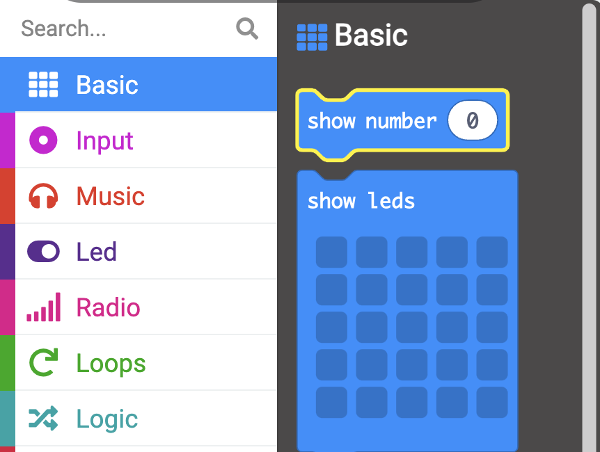

The **micro:bit** is a small computer that you can use to interact with the world around you.

This project will help you **discover** what the **micro:bit** can do before you go on to explore it in more detail. 

### What you will make

Here's a project to remind you to loosen up and strike a pose! This could be after a long day at school, or a way to cheer you and your friends up. You can program the micro:bit buttons to help you remember to have some silly fun.

In this project you are going to make a **silly reminder**. 

You will: 
+ Display icons, text and numbers on the LEDs
+ Use <code style="background-color: #00A4A6">if</code> blocks to control what is displayed
+ Use the <code style="background-color: #1E90FF">pause</code> block to create a countdown timer
+ Play sounds
+ Use buttons to change the display

--- no-print ---

### Play ▶️

--- task ---

+ What happens when the program starts?
+ What happens when the countdown runs?
+ What happens when the countdown finishes?
+ What happens if you `press` Button A?
+ What happens if you `press` Button A?

<iframe style="position:absolute;top:0;left:0;width:100%;height:100%;" src="https://makecode.microbit.org/---run?id=_WRMV6RCMU5Fb" allowfullscreen="allowfullscreen" sandbox="allow-popups allow-forms allow-scripts allow-same-origin" frameborder="0"></iframe>

--- /task ---

--- /no-print ---

### Opening MakeCode

To get started creating your micro:bit project, open the MakeCode editor.

--- task ---

Open the MakeCode editor at [makecode.microbit.org](https://makecode.microbit.org)

--- collapse ---

---
title: Offline version of the editor
---

There is also a [downloadable version of the MakeCode editor](https://makecode.microbit.org/offline-app).

--- /collapse ---

--- /task ---

Once the editor is open, create a New Project and give your project a name. 

--- task ---

Click on the **New Project** button.

--- /task ---

--- task ---

Create your project with the name `silly reminder` and click **Create**.

**Tip:** Give your project a helpful name that relates to the activity you’re creating. This will make it easier to find if you create other projects on MakeCode.

--- /task ---

### The MakeCode Editor

Created by the micro:bit Foundation, the **MakeCode editor** has everything you need to get started coding on micro:bit. 

On the left side there is a **simulator**, this contains a virtual micro:bit that you can use to test your code! 

It has all the features and buttons found on a V2 micro:bit, including:
+ LED display
+ Speaker
+ Microphone
+ Input buttons
    + A
    + B
    + Logo

In the centre there is the **blocks panel** which is colour-coded and allows you to access various code blocks.

On the right side is the **code editor panel** to drag and drop blocks into when creating your program.

The MakeCode editor panel already contains two blocks: `on start` and `forever`.

### Display Icon

You will use the <code style="background-color: #1E90FF">on start</code> block to see how the LEDs on the simulator work.

--- task ---

Click on the <code style="background-color: #1E90FF">Basic</code> menu. 

This will expand to show you the blocks available.

Drag the <code style="background-color: #1E90FF">show icon</code> block and place it **inside** the <code style="background-color: #1E90FF">on start</code> block. 

This should fit in place like a puzzle.

<iframe style="position:relative;top:0;left:0;width:50%;height:50%;" src="https://makecode.microbit.org/---codeembed#pub:_iVKhocCVxR3f" allowfullscreen="allowfullscreen" frameborder="0" sandbox="allow-scripts allow-same-origin"></iframe>

--- /task ---

--- task ---

Click the down arrow on the <code style="background-color: #1E90FF">show icon</code> block and choose any icon of your choice.

In this example, we have chosen the `heart` icon.

--- /task ---

--- task ---

**Test:** 
The LED display should light up on the simulator, showing your chosen icon.

Well done for getting the LEDs on the micro:bit to light up!

--- /task ---

### Choose some poses

You will need to decide which silly faces/poses you will make whenever you push a micro:bit button. Here are some ideas for poses:

+ A big cheesy grin
+ Jumping jacks
+ Be a tree
+ Flexing muscle pose

### Create a timer for each pose

Create a variable that will be used as a timer for how long you should hold each pose.

--- task ---

Open the <code style="background-color: #DC143C">Variables</code> menu, and click **Make a variable**.

--- /task ---

--- task ---

Name the new variable `timer`, then click the `Ok` button.

--- /task ---

New blocks will be created that you can place in your program to use and change the value stored in the `timer` variable. 

--- task ---

Drag the <code style="background-color: #DC143C">set</code> block inside the <code style="background-color: #1E90FF">on start</code> block and change the `0` to `10`.

<iframe style="position:relative;top:0;left:0;width:65%;height:65%;" src="https://makecode.microbit.org/---codeembed#pub:_f4yMbPEpHFwv" allowfullscreen="allowfullscreen" frameborder="0" sandbox="allow-scripts allow-same-origin"></iframe>

--- /task ---

### Set icon for each pose

You will now program the A and B input buttons on the micro:bit to help you select an icon for each pose.

--- task ---

Click on the <code style="background-color: #D400D4">Input</code> menu and drag out an <code style="background-color: #D400D4">on button</code> block to the **code editor panel**.

<iframe style="position:relative;top:0;left:0;width:50%;height:50%;" src="https://makecode.microbit.org/---codeembed#pub:_TUwcRCfFsHCb" allowfullscreen="allowfullscreen" frameborder="0" sandbox="allow-scripts allow-same-origin"></iframe>

--- /task ---

--- task ---

From the <code style="background-color: #1E90FF">Basic</code> menu, drag the <code style="background-color: #1E90FF">show leds</code> block inside the <code style="background-color: #D400D4">on button</code> block.

<iframe style="position:relative;top:0;left:0;width:75%;height:75%;" src="https://makecode.microbit.org/---codeembed#pub:_7Ugf5a3JXb81" allowfullscreen="allowfullscreen" frameborder="0" sandbox="allow-scripts allow-same-origin"></iframe>

Click on each of the squares to draw your pose. 

In this example, we have drawn a smiley face as a silly pose.

<iframe style="position:relative;top:0;left:0;width:75%;height:75%;" src="https://makecode.microbit.org/---codeembed#pub:_XsR7jJ2wiTAx
" allowfullscreen="allowfullscreen" frameborder="0" sandbox="allow-scripts allow-same-origin"></iframe>

--- /task ---

The icon should be displayed for some time before changing. 

You will use a <code style="background-color: #1E90FF">pause</code> block for this. This is a set number of milliseconds (1/1000th of a second).

--- task ---

From the <code style="background-color: #1E90FF">Basic</code> menu, drag a <code style="background-color: #1E90FF">pause</code> block below the <code style="background-color: #1E90FF">show leds</code> block.

<iframe style="position:relative;top:0;left:0;width:75%;height:75%;" src="https://makecode.microbit.org/---codeembed#pub:_AVuUqsMq8hbR
" allowfullscreen="allowfullscreen" frameborder="0" sandbox="allow-scripts allow-same-origin"></iframe>

--- /task ---

--- task ---

Change the 100 in the <code style="background-color: #1E90FF">pause</code> block to a longer time, so the icon can be displayed for longer. We have set it to 2000 (2 seconds) in this example.

<iframe style="position:relative;top:0;left:0;width:75%;height:75%;" src="https://makecode.microbit.org/---codeembed#pub:_2AcgfYKeAeFu
" allowfullscreen="allowfullscreen" frameborder="0" sandbox="allow-scripts allow-same-origin"></iframe>

--- /task ---

--- task ---

Right-click on the `set timer` block inside the `on start` block. 

Click `Duplicate` to make a copy of it.

--- /task ---

--- task ---

Place the duplicated `set timer` below the `pause (ms) 2000` block inside the `on button A pressed` block.

<iframe style="position:relative;top:0;left:0;width:75%;height:75%;" src="https://makecode.microbit.org/---codeembed#pub:_1HLLsHXAPhK0
" allowfullscreen="allowfullscreen" frameborder="0" sandbox="allow-scripts allow-same-origin"></iframe>

--- /task ---

To create more than one pose that can be selected, you will need to use another input button on the micro:bit. This will be the `on button B pressed` block.

--- task ---

Right-click on the entire `on button A pressed` block. 

Click `Duplicate` to make a copy of it.

You will now have an exact copy of all the blocks of code inside `on button A pressed` on the code editor panel.

--- /task ---

--- task ---

Click the down arrow next to the A on your duplicated `on button A pressed` block. Change the `A` to `B`.

--- /task ---

--- task ---

Change the squares on the `show leds` block inside the `on button B pressed` block to create a new pose icon.

--- /task ---

--- task ---

When your program runs, you should see your icon appear.

**Test** Press the `A` button to test the icon that displays on the led. Take note of how long it shows for

Do the same to test the `B` button.

**Change** You can change the value in your `pause ms` block to increase or decrease the time the icons are shown on each button press.

--- /task ---

### Create a countdown

You will now create a countdown using the `timer` variable that you previously set to `10` to represent 10 seconds. 

The `timer` variable value will decrease by 1 each time.

From the <code style="background-color: #00A4A6">Logic</code> menu, drag the `if` logic block. 

[The Logic menu - with new blocks to set the value of timer, to change the value of timer and to use the value of timer in your code.](images/ifelse-condition.png)

Place it inside the `forever` block.

--- /task ---

--- task ---

From the <code style="background-color: #00A4A6">Logic</code> menu, drag out a comparison block `0 = 0`.

Place it inside the `true` space within the `if..then..else` block.

--- /task ---

--- task ---

From the `Variables` block menu, drag out the `timer` variable block and place it inside the first `0` on the `0 = 0` comparison block.

Change the `=` to a `>` than symbol using the drop-down arrow on the comparison block.

--- /task ---

To create a countdown, the timer variable value needs to reduce by `1` (but only if the timer is greater than `0`).

--- task ---

From the `Variables` block menu, drag the `change timer by 1` block and place it inside the `if.. then` section of blocks. 

Also change `1` to `-1`.

--- task ---

From the <code style="background-color: #1E90FF">Basic</code> menu, drag the `show number` block and place it below the `change number by -1` block.

From the <code style="background-color: #DC143C">Variables</code> menu, drag the `timer` variable inside the `0` on the `show number` block

--- /task ---

To check if the timer is greater than 0, then make it count down, you will need an `if..then..else` logic condition block. 

--- task ---

--- collapse ---

---
title: Adding sound for dramatic effect
---

From the <code style="background-color: #E63022">Music</code> menu, drag the `play..tone..Middle C for 1 beat.. until done` block. Place it below the `change timer by -1` variable block.

Click on the `Middle C` module and a piano keys console will appear. Choose a suitable note for your timer. In this example, we have selected `Middle A`.

--- /collapse ---

--- /task ---

After each value of `timer` is displayed on the micro:bit, you need to add a 1-second pause.

--- task ---

Right-click on any of the `pause ms` blocks already on the editor panel and duplicate it. 

Drag this below the `play tone..for 1 beat` block.

Change `2000`ms to `1000`ms. 

--- /task ---

After the countdown finishes, you need a message to tell the user to change their silly pose.

You can do this by making use of the `else`.

--- task ---

Inside the <code style="background-color: #1E90FF">Basic</code> menu, drag out the `show string` block. Place it inside the `else` part of the `if..then..else` block.

Change the string `Hello!` to `Pose!`.

--- /task ---

--- task ---

**Run** the program to check that all your code is working. 

**Press** the A button to see the pose icon displayed. 

**Press** the B button to see another pose icon displayed.  

**Check** the countdown timer is working and counting from 10 backwards. 

**Check** that a tone is played after each second counts down.  

--- /task ---

--- save --- 

--- task ---

[[[download-to-microbit]]]

--- /task ---

--- task ---

**Test** Run your program on the physical micro:bit. 

--- /task ---

### Upgrade your project

You can upgrade your project to make it more engaging by doing the following:

+ Add more silly poses so you can have a wider range to choose from.
+ Randomise the pose that gets selected after the timer reaches 0
+ Use A and B buttons
