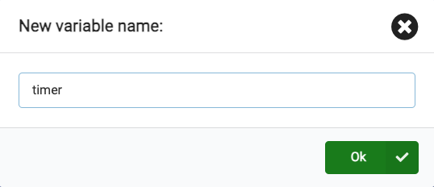

This is a **Discover** project, this project will help you explore what the **micro:bit** can do and decide whether you want to learn more. 

### What you will make

Here's a project to remind you to loosen up and stike a pose! This could be after a long day at school, or a way to cheer you and your friends up. You can program the micro:bit buttons to help you remember to have some silly fun.

In this project you are going to make a **silly reminder**. 

You will: 
+ Use variables to store data
+ Display icons, text and numbers on the LEDs
+ Play sounds
+ Use `if... then` blocks to select what to display
+ Use the pause blocks to create a countdown timer
+ Use buttons

### Opening MakeCode

To get started creating your micro:bit project, you will need to open the MakeCode editor.

--- task ---

Open the MakeCode editor at [makecode.microbit.org](https://makecode.microbit.org)

--- collapse ---

---
title: Offline version of the editor
---

There is also a [downloadable version of the MakeCode editor](https://makecode.microbit.org/offline-app).

--- /collapse ---

--- /task ---

Once the editor is open, you will need to create a New Project and give your project a name. 

--- task ---

Click on the **New Project** button.

--- /task ---

--- task ---

Create your project with the name `silly-reminder` and click **Create**.

**Tip:** Give your project a helpful name that relates to the activity you’re creating. This will make it easier to find if you create other projects on MakeCode.

--- /task ---

[[[makecode-tour]]]

### Display Icon

You will make use of the `on start` block to see how the LEDs on the simulator work.

--- task ---

Click on the `Basic` blocks menu. This will expand to show you various groups of blocks that you can use in your project.

Drag the `show icon` block and place it **inside** the `on start` block. 

Once placed in, the block will fit in place like a puzzle.

<iframe style="position:relative;top:0;left:0;width:75%;height:75%;" src="https://makecode.microbit.org/---codeembed#pub:_g2caj6PsuPET" allowfullscreen="allowfullscreen" frameborder="0" sandbox="allow-scripts allow-same-origin"></iframe>

--- /task ---

--- task ---

Click the down arrow on the show icon block and choose any icon of your choice.

In this example we have chosen the `heart` icon.

--- /task ---

--- task ---

**Test:** Click the play button on the emulator, the LED display should light up, showing your chosen icon.

Well done for getting the leds on the micro:bit to light up!

--- /task ---

### Choose some poses

You will need to decide what silly faces/poses you will make whenever you push a micro:bit button. Here are some ideas for poses you could use:

+ Happy face icon for when you're feeling happy
+ An icon pose for when you're feeling excited
+ An icon pose to energise you when you're feeling tired
+ An icon pose for when you're feeling restless

### Create a timer for each pose

Create a variable that will be used as a timer for how long you should hold each pose.

--- task ---
Open the `Variables` block menu, and click **Make a variable**.

--- /task ---

--- task ---

Name the new variable `timer`. 

--- /task ---

New blocks will be created that you can use in your program and change the value stored in the `timer` variable. 

--- task ---

Drag the `set [timer] to 0` block inside the `onstart` block and change the 0 to 10.

<iframe style="position:relative;top:0;left:0;width:75%;height:75%;" src="https://makecode.microbit.org/---codeembed#pub:_f4yMbPEpHFwv" allowfullscreen="allowfullscreen" frameborder="0" sandbox="allow-scripts allow-same-origin"></iframe>

--- /task ---

### Set icon for each pose

You will now program the A and B input buttons on the micro:bit to help you select an icon for each pose.

--- task ---

Click on the `Input` blocks menu and drag the `on button A pressed` block.

<iframe style="position:relative;top:0;left:0;width:75%;height:75%;" src="https://makecode.microbit.org/---codeembed#pub:_TUwcRCfFsHCb" allowfullscreen="allowfullscreen" frameborder="0" sandbox="allow-scripts allow-same-origin"></iframe>

 Place it onto the **code editor panel** 

--- /task ---

--- task ---
Inside the `Basic` blocks menu, drag the `show leds` block below the `on button A pressed` block.

<iframe style="position:relative;top:0;left:0;width:75%;height:75%;" src="https://makecode.microbit.org/---codeembed#pub:_7Ugf5a3JXb81" allowfullscreen="allowfullscreen" frameborder="0" sandbox="allow-scripts allow-same-origin"></iframe>

You can click on each of the squares to draw your picture. In this example, we have drawn a smiley face as a silly pose.

<iframe style="position:relative;top:0;left:0;width:75%;height:75%;" src="https://makecode.microbit.org/---codeembed#pub:_XsR7jJ2wiTAx
" allowfullscreen="allowfullscreen" frameborder="0" sandbox="allow-scripts allow-same-origin"></iframe>

--- /task ---

You will want the icon to be displayed for some time before changing so you will need to make use of a `pause ms` block. This is measured in milliseconds.

--- task ---

Also drag a `pause (ms) 100` block from the `Basic` menu and drag it below the `show leds` block inside the `on button A pressed` block.

--- /task ---

--- task ---

Change the 100 in the `pause (ms) 100` block to a longer time so the icon can be displayed for longer. We have set it to 2000 ms in this example.

--- /task ---

--- task ---

Right click on the `set timer` block inside the `on start` block. Click `Duplicate` to make a copy of it.

--- /task ---

--- task ---

Place the duplicated `set timer` below the `pause (ms) 2000` block inside the `on button A pressed` block.

--- /task ---

To create more than one pose that can be selected, you will need to use another input button on the micro:bit. This will be the `on button B pressed` block.

--- task ---

Right click on the entire `on button A pressed` block. Click `Duplicate` to make a copy of it.

You will now have an exact copy of all the blocks of code inside `on button A pressed` on the code editor panel.

--- /task ---

--- task ---

Click the down arrow next to the A on your duplicated `on button A pressed` block. Change the `A` to `B`.

--- /task ---

--- task ---

Change the squares on the `show leds` block inside the `on button B pressed` block to create a new pose icon.

--- /task ---

--- task ---

**Run** the program and you should see the `heart` icon (or your chosen icon) appear. 

**Test** Press the `A` button to test the icon that displays on the led. Take a note of how long it shows for

Do the same to test the `B` button.

**Change** You can change the value in your `pause ms` block to increase or decrease the time the icons are shown for on each button press.

--- /task ---

### Create a countdown

You will now create a countdown using the `timer` variable which you had previously set to 10 seconds and ensure that the timer decreases by 1 second, each time.

--- task ---
From the `Basic` menu, drag the `show number` block and place it inside the `forever` block on the editor panel.

Click on the `Variables` menu, drag out the `timer` variable block and place it inside the `0` on the `show number` block

--- /task ---

To create the logic to check if the timer is greater than 0, then make it count down, you will need an `if..then..else` logic condition block. 

--- task ---
Click on the `Logic` menu. Drag the `if..then..else` logic block and place it below the `show number` block.

--- /task ---

--- task ---

From the `Logic` menu, also drag out a comparison block `0=0`.

Place it inside the `true` space within the `if..then..else` block.

--- /task ---

--- task ---
From the `Variables` menu, drag out the `timer` variable block and place it inside the first `0` on the `0=0` comparison block.

Change the `=` to a `>` than symbol using the drop down arrow on the comparison block.

--- /task ---

You will want to reduce the timer by -1 if the timer is greater than 0.

--- task ---

Using the `Variables` menu, drag the `change timer by 1` block and place it within the `if.. then` section of blocks. Also change the `1` to `-1`.

--- collapse ---

---
title: Adding sound for dramatic effect
---

Inside the `Music` menu, drag the `play..tone..Middle C for 1 beat.. until done` block. Place it below the `change timer by -1` variable block.

Click on the `Middle C` module and a piano keys console will appear. Choose a suitable note for your timer. In this example we have selected `Middle` A.

--- /collapse ---

--- /task ---

After each second is displayed on the micro:bit, you can also add a pause to make the timer more realistic.

--- task ---

Right click on any of the `pause ms` blocks already on the editor panel to duplicate it. Drag and drop this below the `play tone..for 1 beat` block.

Change `2000` ms to `1000`ms. You can also try out various durations to suit your preference.
--- /task ---

You can now add a message to let you know when to change your silly pose. You can do this by making use of the `else` condition block.

--- task ---

Inside the `Basic` menu, drag out the `show string` block. Place it below the `else` condition block inside the `if..then..else` condition block.

Change the string `Hello!` to `Pose`.

--- /task ---

--- task ---

**Run** the program to check that all your code is working. 

**Press** the A button to see the pose icon displayed. 

**Press** the B button to see another pose icon displayed.  

**Check** the countdown timer is working and counting from 10 backwards. 

**Check** that a tone is played after each second counts down.  

--- /task ---

--- save --- 

### Uploading your program to the micro:bit

**Save** and download your code so you can test it out on a physical micro:bit.

[[[download-to-microbit]]]

When you have downloaded your program to your physical micro:bit, it will run immediately.

--- task ---

**Test** Run your program on the physical micro:bit. You should now see icons randomly chosen when you shake the device.

--- /task ---

### Upgrade your project

You can upgrade your project to make it more engaging by doing the following:

+ Add more silly poses so you can have a wider range to choose from.
+ Randomise the pose that gets selected afer the timer counts down
+ Add other input gestures such as shake and on logo press.
