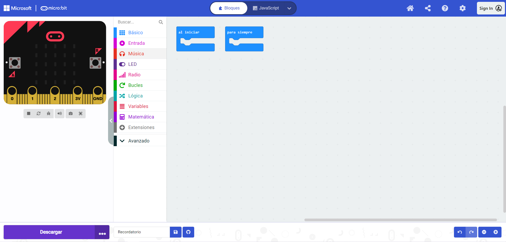
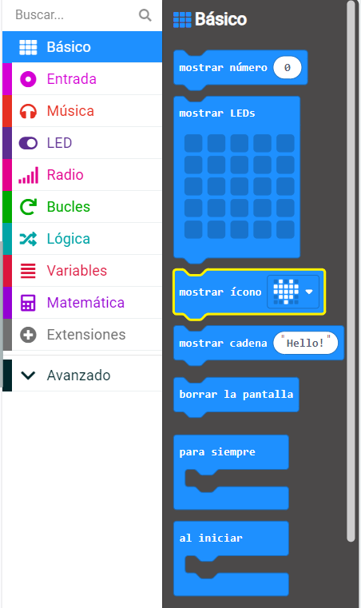

El **micro:bit** es una pequeña computadora que puedes usar para interactuar con el mundo que te rodea.

Este proyecto te ayudará a **descubrir** lo que **micro:bit** puede hacer.

### Lo que harás

¡Este proyecto te recuerda que pases tiempo de estar tranquilo, divertirte y hacer una pose! Esto podría ser después de un largo día en la escuela o como una forma de animarte a ti y a tus amigos. Puedes programar los botones micro:bit para recordarte que debes divertirte un poco.

En este proyecto, harás un **recordatorio**.

Vas a:
+ Mostrar iconos, texto y números en los LEDs
+ Usar un bloque `si`{:class='microbitlogic'} para controlar lo que se muestra
+ Usar el bloque `pausa`{:class='microbitbasic'} para crear un temporizador regresivo
+ Reproducir sonidos
+ Usar botones para cambiar la pantalla

--- no-print ---

### Reproducir ▶️

--- task ---

+ ¿Qué sucede cuando comienza el programa?
+ ¿Qué sucede cuando se ejecuta la cuenta regresiva?
+ ¿Qué pasa cuando termina la cuenta regresiva?
+ ¿Qué pasa si `presionas` el Botón A?
+ ¿Qué pasa si `presionas` el Botón B?

<div style="position:relative;height:100%;padding-bottom:125%;padding-top:0;overflow:hidden;">
<iframe style="position:absolute;top:0;left:0;width:100%;height:100%;" src="https://makecode.microbit.org/---run?id=_KiYLAWM3cip4" allowfullscreen="allowfullscreen" sandbox="allow-popups allow-forms allow-scripts allow-same-origin" frameborder="0"></iframe>
</div>

--- /task ---

--- /no-print ---

### Abrir MakeCode

Para empezar a crear tu proyecto micro:bit, abre el editor MakeCode.

--- task ---

Abre el editor de MakeCode en [makecode.microbit.org](https://makecode.microbit.org){:target="_blank"}

--- collapse ---

---
title: Versión del editor sin conexión
---

También hay una versión [descargable del editor MakeCode](https://makecode.microbit.org/offline-app){:target="_blank"}.

--- /collapse ---

--- /task ---

Una vez que el editor esté abierto, crea un nuevo proyecto y asígnale un nombre.

--- task ---

Haz clic en el botón **Nuevo proyecto**.


--- /task ---

--- task ---

Dale a tu proyecto el nombre `Recordatorio` y haz clic en **Crear**.


**Consejo:** Para que tu proyecto sea más fácil de encontrar más tarde, dale un nombre útil que se relacione con lo que estás creando.

--- /task ---

### El editor MakeCode

Creado por la Fundación micro:bit, el editor **de MakeCode** tiene todo lo que necesitas para comenzar a programar con micro:bit.



A la izquierda. hay un **simulador**. ¡Este es un micro:bit virtual que puedes usar para probar tu código!

Tiene todas las funciones y botones que se encuentran en un micro:bit V2, incluyendo:
+ Pantalla LED
+ Altavoz
+ Micrófono
+ Botones de entrada
    + A
    + B
    + Logo

En el centro se encuentra el panel de **bloques**, que está codificado por colores y permite acceder a varios bloques de códigos.

En el lado derecho, está el panel **editor de código**. Aquí es donde arrastras y sueltas bloques para crear tu programa.

El panel del editor MakeCode ya contiene dos bloques: `al iniciar`{:class='microbitbasic'} y `para siempre`{:class='microbitbasic'}.

### Icono de pantalla

Usarás el bloque `al iniciar`{:class='microbitbasic'} para ver cómo funcionan los LEDs en el simulador.

--- task ---

Haz clic en el menú `Básico`{:class='microbitbasic'}.

Se expandirá para mostrarte los bloques disponibles.



Arrastra el bloque `mostrar el icono`{:class='microbitbasic'} y colócalo **dentro de** el bloque `al iniciar`{:class='microbitbasic'}.

Esto debería encajar en su lugar como una pieza de rompecabezas.

```microbit
basic.showIcon(IconNames.Heart)
```

--- /task ---

--- task ---

Haz clic en la flecha hacia abajo en el bloque `mostrar el icono`{:class='microbitbasic'} y elige un icono.


En este ejemplo, hemos elegido el ícono `corazón`.

--- /task ---

--- task ---

**Prueba:** La pantalla LED debería iluminarse en el simulador y mostrar el icono elegido.

¡Bien hecho! ¡Has hecho que los LED del micro:bit se iluminen!

--- /task ---

### Elegir algunas poses

Tendrás que decidir sobre algunas caras o poses que harás cuando pulses un botón micro:bit. Aquí hay algunas ideas para ayudarte:

+ Una gran sonrisa
+ Saltos de tijera
+ Sé un árbol
+ Postura de flexión de músculos

### Crea un temporizador para cada pose

Crea una variable que se usará en un temporizador que te indique cuánto tiempo debes mantener cada pose.

--- task ---

Abre el menú `Variables`{:class='microbitvariables'} y haz clic en **Crear una variable**.


--- /task ---

--- task ---

Nombra la nueva variable `tiempo`y haz clic en el botón **Aceptar**.


--- /task ---

Se crearán nuevos bloques que puedes colocar en tu programa para usar y cambiar el valor almacenado en la variable `tiempo`.


--- task ---

Arrastra el bloque `fijar`{:class='microbitvariables'} **bajo** el bloque `mostrar icono`{:class='microbitbasic'}.

```microbit
let tiempo = 0
basic.forever(function () {
    basic.showIcon(IconNames.Heart)
    tiempo = 0
})
```

--- /task ---

### Establecer el icono para cada pose

Ahora programarás los botones de entrada A y B en el micro:bit para ayudarte a seleccionar qué pose hacer.

--- task ---

Haz clic en el menú `Entrada`{:class='microbitinput'} y arrastra un bloque `Al presionar el botón`{:class='microbitinput'} al panel **del editor de código**.

```microbit
input.onButtonPressed(Button.A, function () {

})
```

--- /task ---

--- task ---

Del menú `Básico`{:class='microbitbasic'}, arrastra el bloque `mostrar leds`{:class='microbitbasic'} dentro del bloque `Al presionar el botón`{:class='microbitinput'}.

```microbit
input.onButtonPressed(Button.A, function () {
    basic.showLeds(`
        . . . . .
        . . . . .
        . . . . .
        . . . . .
        . . . . .
        `)
})
```

Haz clic en los cuadrados para dibujar tu pose. Los cuadrados blancos se iluminarán en la pantalla LED.

En este ejemplo, hemos dibujado una carita sonriente como pose tonta.

```microbit
input.onButtonPressed(Button.A, function () {
    basic.showLeds(`
        . # . # .
        . . . . .
        . . # . .
        # . . . #
        . # # # .
        `)
})
```

--- /task ---

El icono debe mostrarse por cierto tiempo antes de cambiar.

Para consertuirlo usarás un bloque `pausa`{:class='microbitbasic'}. Esto detiene el programa durante un número determinado de milisegundos (1/1000 de segundo).

--- task ---

Arrastra un bloque `pausa`{:class='microbitbasic'} del menú `Básico`{:class='microbitbasic'}, debajo del bloque `mostrar leds`{:class='microbitbasic'}.

```microbit
input.onButtonPressed(Button.A, function () {
    basic.showLeds(`
        . # . # .
        . . . . .
        . . # . .
        # . . . #
        . # # # .
        `)
    basic.pause(100)
})
```

--- /task ---

--- task ---

Cambia el bloque `100` en la `pausa`{:class='microbitbasic'} a un número más grande, para que la pausa sea más larga, y el icono se muestre durante más tiempo. En este ejemplo lo hemos configurado en 2 segundos (`2000`).

```microbit
input.onButtonPressed(Button.A, function () {
    basic.showLeds(`
        . # . # .
        . . . . .
        . . # . .
        # . . . #
        . # # # .
        `)
    basic.pause(2000)
})
```

--- /task ---

--- task ---

Haz clic derecho en el bloque `fijar`{:class='microbitvariables'} dentro del bloque `al iniciar`{:class='microbitbasic'}.

Haz clic en **Duplicar** para hacer una copia.

Coloca el bloque duplicado `fijar`{:class='microbitvariables'} encima del bloque `mostrar LEDs`{:class='microbitbasic'}.

Cambia el `0` a `10` en el nuevo bloque.


--- /task ---

Para permitir que se seleccione más de una pose, usarás el Botón B.

--- task ---

Haz clic derecho en todo el bloque `botón`{:class='microbitinput'}.

Haz clic en `Duplicar` para hacer una copia.

Ahora tendrás dos bloques `botón`{:class='microbitinput'} en el panel **del editor de código**.

--- /task ---

--- task ---

Haz clic en la flecha hacia abajo junto al bloque `A`{:class='microbitinput'} en tu `botón duplicado`{:class='microbitinput'}. Cambia la `A`{:class='microbitinput'} a `B`{:class='microbitinput'}.


--- /task ---

--- task ---

Para crear un nuevo icono de pose cambia los cuadrados en el nuevo bloque `mostrar leds`{:class='microbitbasic'} dentro del nuevo bloque `botón`{:class='microbitinput'}.

--- /task ---

--- task ---

**Prueba**

+ Haz clic en el botón `A` en el simulador para ver qué icono se muestra en el LED. Toma nota de cuánto tiempo se muestra.
+ Haz lo mismo para probar el botón `B`.
+ Cambia el valor de tu bloque `pausa`{:class='microbitbasic'} para aumentar o disminuir el tiempo en que se muestran los iconos al presionar cada botón.

--- /task ---

### Crea una cuenta regresiva

Ahora crearás una cuenta regresiva de 10 segundos.

El valor de la variable `tiempo`{:class='microbitvariables'} disminuirá en `1` cada segundo, pero **solo** si el tiempo es **mayor que 0**.

--- task ---

Del menú `Lógica`{:class='microbitlogic'}, arrastra un bloque `si`{:class='microbitlogic'}.

Colócalo en el bloque `para siempre`{:class='microbitbasic'}.

```microbit
basic.forever(function () {
    if (true) {

    }
})
```

--- /task ---

--- task ---

Del menú `Lógica`{:class='microbitlogic'}, arrastra un bloque de comparación `0 = 0`{:class='microbitlogic'}.


Cambia el `=`{:class='microbitlogic'} a un símbolo `>`{:class='microbitlogic'} (mayor que) usando la flecha desplegable en el bloque de comparación.

Coloca el bloque de comparación dentro del espacio `verdadero`{:class='microbitlogic'} en el bloque `si`{:class='microbitlogic'}.

```microbit
basic.forever(function () {
    if (0 > 0) {

    }
})
```

--- /task ---

--- task ---

Arrastra el bloque `tiempo`{:class='microbitvariables'} del menú `Variables`{:class='microbitvariables'} y colócalo dentro del primer bloque `0` en el bloque `0 > 0`{:class='microbitlogic'}.

```microbit
basic.forever(function () {
    let tiempo = 0
    if (tiempo > 0) {

    }
})
```

--- /task ---

Para crear una cuenta regresiva, el valor de la variable `tiempo` debe reducirse en `1`.

--- task ---

Arrastra el bloque `tiempo`{:class='microbitvariables'} del menú `Variables`{:class='microbitvariables'} y colócalo dentro de la sección `si` {:class='microbitlogic'}.

Cambia de `1` a `-1`.

```microbit
let tiempo = 0
basic.forever(function () {
    if (tiempo > 0) {
        tiempo += -1
    }
})
```

--- /task ---

--- task ---

Arrastra el bloque `mostrar número`{:class='microbitbasic'} del menú `Básico`{:class='microbitbasic'}, y colócalo debajo del bloque `cambiar`{:class='microbitvariables'}.


Del menú `Variables`{:class='microbitvariables'}, arrastra la variable `tiempo`{:class='microbitvariables'} dentro del bloque `0` en `mostrar el número`{:class='microbitbasic'}.

```microbit
let tiempo = 0
basic.forever(function () {
    if (tiempo > 0) {
        tiempo += -1
        basic.showNumber(tiempo)
    }
})
```

--- /task ---

Después de cada valor de `tiempo`{:class='microbitvariables'} se muestra en el micro:bit, necesitas añadir una pausa de 1 segundo.

--- task ---

Haa clic derecho en uno de tus bloques `pausa`{:class='microbitbasic'} y duplícalo.

Arrastra el bloque duplicado `pausa`{:class='microbitbasic'} debajo del bloque `mostrar número`{:class='microbitbasic'}.

Cambia `2000` a `1000`.

```microbit
let tiempo = 0
basic.forever(function () {
    if (tiempo > 0) {
        tiempo += -1
        basic.showNumber(tiempo)
        basic.pause(1000)
    }
})
```

--- /task ---

Después de que la cuenta regresiva termine, el valor será 0.

Necesita un mensaje para decirle al usuario que cambie su pose.

Harás esto agregando una sección `si no`{:class='microbitlogic'} al bloque `si`{:class='microbitlogic'}.

--- task ---

Haz clic en el símbolo `+` en la parte inferior del bloque `si`{:class='microbitlogic'}. Esto creará una sección `si no`{:class='microbitlogic'}.

Del menú `Básico`{:class='microbitbasic'}, arrastra el bloque `mostrar cadena`{:class='microbitbasic'} y colócalo dentro de la sección `si no`{:class='microbitlogic'}.

Cambia la cadena `¡Hola!` a `¡Pose!`.

Del menú `Básico`{:class='microbitbasic'}, arrastra el bloque `borrar la pantalla`{:class='microbitbasic'} y suéltalo **sobre** el bloque `mostrar cadena`{:class='microbitbasic'}.

```microbit
let tiempo = 0
basic.forever(function () {
    if (tiempo > 0) {
        tiempo += -1
        basic.showNumber(tiempo)
        basic.pause(1000)
    } else {
        basic.clearScreen()
        basic.showString("¡Pose!")
    }
})
```

--- /task ---

--- collapse ---

---
title: Añade sonido para lograr un efecto dramático
---

Arrastra un bloque `reproducir tono`{:class='microbitmusic'} del menú `Música`{:class='microbitmusic'}.

Colócalo debajo del bloque `cambiar`{:class='microbitvariables'}.

Haz clic en el menú desplegable `Do medio` y aparecerá una consola de teclas de piano.

Elige un tono para tu temporizador.

Hemos seleccionado `La medio`.

Haz clic en el menú desplegable `hasta que termine`{:class='microbitmusic'} y cámbialo a `in background`{:class='microbitmusic'}.

```microbit
let tiempo = 0
basic.forever(function () {
    if (tiempo > 0) {
        tiempo += -1
        music.play(music.tonePlayable(440, music.beat(BeatFraction.Whole)), music.PlaybackMode.InBackground)
        basic.showNumber(tiempo)
        basic.pause(1000)
    } else {
        basic.clearScreen()
        basic.showString("¡Pose!")
    }
})
```

--- /collapse ---

--- task ---

**Prueba** tu programa en el simulador:

+ **Haz clic en** botón A para que se muestre el icono de pose.

+ **Haga clic en** Botón B para ver otro icono de pose.

+ **Verifica que** el temporizador de cuenta regresiva está funcionando y cuenta hacia atrás a partir de 10.

+ **Comprueba** que se reproduce un tono mientras cuenta hacia atrás cada segundo.

--- /task ---

--- task ---

[[[download-to-microbit]]]

Cuando hayas descargado tu programa a tu micro:bit, se ejecutará inmediatamente.

--- /task ---

--- task ---

**Prueba** tu programa en el micro:bit físico.

--- /task ---

[[[microbit-share]]]

### Proyecto terminado

Si quieres comprobar tu código puedes encontrar [el proyecto completado aquí](https://makecode.microbit.org/_8K430qR3oH7t){:target="_blank"}.

### Mejora tu proyecto

Puedes actualizar tu proyecto de recordatorio de la siguiente manera:

+ Añadiendo otra pose más tonta que se muestre cuando presionas los botones A y B juntos (`A+B`)
+ Aumentar la cantidad de tiempo entre poses

***

Este proyecto fue traducido por voluntarios:

Laura Lurati

Gracias a los voluntarios, podemos dar a las personas de todo el mundo la oportunidad de aprender en su propio idioma. Puedes ayudarnos a llegar a más personas ofreciéndote como voluntario para traducir. Más información en [rpf.io/translate](https://rpf.io/translate).