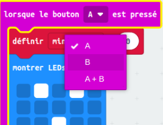

Le **micro:bit** est un petit ordinateur que tu peux utiliser pour interagir avec le monde qui t'entoure.

Ce projet t'aidera **à découvrir** ce que le **micro:bit** peut faire.

### Ce que tu vas faire

Ce projet te rappelle de prendre le temps de faire des bêtises, de t'amuser et de prendre une pose ! Cela peut être après une longue journée à l'école ou pour te remonter le moral, toi et tes amis. Tu peux programmer les boutons micro:bit pour t'aider à te rappeler de t'amuser un peu.

Dans ce projet, tu feras un **rappel idiot**.

Tu vas :
+ Afficher des icônes, du texte et des chiffres sur les LED
+ Utiliser des blocs `si`{:class='microbitlogic'} pour contrôler ce qui est affiché
+ Utiliser le bloc `pause`{:class='microbitbasic'} pour créer un compte à rebours
+ Jouer des sons
+ Utiliser les boutons pour changer l'affichage

--- no-print ---

### Joue ▶️

--- task ---

+ Que se passe-t-il lorsque le programme démarre ?
+ Que se passe-t-il une fois le compte à rebours lancé ?
+ Que se passe-t-il une fois le compte à rebours terminé ?
+ Que se passe-t-il si tu `appuies sur` le bouton A ?
+ Que se passe-t-il si tu `appuies sur` le bouton B ?

<div style="position:relative;height:100%;padding-bottom:125%;padding-top:0;overflow:hidden;">
<iframe style="position:absolute;top:0;left:0;width:100%;height:100%;" src="https://makecode.microbit.org/---run?id=_KiYLAWM3cip4" allowfullscreen="allowfullscreen" sandbox="allow-popups allow-forms allow-scripts allow-same-origin" frameborder="0"></iframe>
</div>

--- /task ---

--- /no-print ---

### Ouvrir MakeCode

Pour commencer à créer ton projet micro:bit, ouvre l'éditeur MakeCode.

--- task ---

Ouvre l'éditeur MakeCode sur [makecode.microbit.org](https://makecode.microbit.org){:target="_blank"}

--- collapse ---

---
title: Version hors ligne de l'éditeur
---

Il y a aussi une version [téléchargeable de l'éditeur MakeCode](https://makecode.microbit.org/offline-app){:target="_blank"}.

--- /collapse ---

--- /task ---

Une fois que l'éditeur est ouvert, crée un nouveau projet et donne un nom à ton projet.

--- task ---

Clique sur le bouton **Nouveau projet**.


--- /task ---

--- task ---

Donne à ton projet le nom `rappel idiot` et clique sur **Créer**.


**Astuce :** pour faciliter la recherche ultérieure de ton projet, donne-lui un nom utile en rapport avec ce que tu crées.

--- /task ---

### L'éditeur MakeCode

Créé par la Fondation micro:bit, l'éditeur **MakeCode** a tout ce dont tu as besoin pour commencer à coder avec micro:bit.


Sur la gauche, il y a un **simulateur**. C'est un micro:bit virtuel que tu peux utiliser pour tester ton code !

Il a toutes les fonctionnalités et tous les boutons d'un micro:bit V2, y compris :
+ Écran LED
+ Haut-parleur
+ Microphone
+ Boutons de saisie
    + A
    + B
    + Logo

Au centre, il y a le panneau **blocs**, qui est codé en couleur et te permet d'accéder à divers blocs de code.

Sur la droite, il y a le panneau **de l'éditeur de code**. C'est là que tu fais glisser et déposer des blocs pour créer ton programme.

Le panneau de l'éditeur MakeCode contient déjà deux blocs : `au démarrage`{:class='microbitbasic'} et `toujours`{:class='microbitbasic'}.

### Afficher une icône

Tu utiliseras le bloc `au démarrage`{:class='microbitbasic'} pour voir comment fonctionnent les LEDs sur le simulateur.

--- task ---

Clique sur le menu `Base`{:class='microbitbasic'}.

Cela va l'étendre pour te montrer les blocs disponibles.


Drag the `show icon`{:class='microbitbasic'} block and place it **inside** the `on start`{:class='microbitbasic'} block.

Cela devrait s’emboîter comme une pièce de puzzle.

```microbit
basic.showIcon(IconNames.Heart)
```

--- /task ---

--- task ---

Clique sur la flèche vers le bas sur le bloc `montrer l'icône`{:class='microbitbasic'} et choisis une icône.


Dans cet exemple, nous avons choisi l'icône `cœur`.

--- /task ---

--- task ---

**Test :** l'écran LED doit s'allumer sur le simulateur et afficher l'icône de ton choix.

Bien joué ! Tu as allumé les LEDs sur l'éclairage micro:bit !

--- /task ---

### Choisir quelques poses

Tu devras décider des grimaces ou des poses idiotes que tu feras chaque fois que tu appuieras sur un bouton micro:bit. Voici quelques idées de poses :

+ Un grand sourire ringard
+ Sauts étoiles
+ Être un arbre
+ Posture de flexion musculaire

### Créer un chronomètre pour chaque pose

Crée une variable qui sera utilisée dans un minuteur qui t'indique combien de temps il faut tenir chaque pose.

--- task ---

Ouvre le menu `Variables`{:class='microbitvariables'} et clique sur **Créer une variable**.


--- /task ---

--- task ---

Nomme la nouvelle variable `minuteur`, puis clique sur le bouton **OK**.


--- /task ---

De nouveaux blocs seront créés que tu peux placer dans ton programme pour utiliser et modifier la valeur stockée dans la variable `minuteur`.


--- task ---

Fais glisser le bloc `définir`{:class='microbitvariables'} **sous** le bloc `montrer l'icône`{:class='microbitbasic'}.

```microbit
let timer = 0
basic.forever(function () {
    basic.showIcon(IconNames.Heart)
    timer = 0
})
```

--- /task ---

### Définir une icône pour chaque pose

Tu vas maintenant programmer les boutons d'entrée A et B sur le micro:bit pour t'aider à choisir quelle pose idiote faire.

--- task ---

Clique sur le menu `Entrée`{:class='microbitinput'} et fais glisser un `lorsque le bouton`{:class='microbitinput'} vers le panneau **de l'éditeur de code**.

```microbit
input.onButtonPressed(Button.A, function () {

})
```

--- /task ---

--- task ---

À partir du menu `Base`{:class='microbitbasic'}, fais glisser le bloc `montrer leds`{:class='microbitbasic'} à l'intérieur du bloc `lorsque le bouton`{:class='microbitinput'}.

```microbit
input.onButtonPressed(Button.A, function () {
    basic.showLeds(`
        . . . . .
        . . . . .
        . . . . .
        . . . . .
        . . . . .
        `)
})
```

Clique sur les carrés pour dessiner ta pose. Des carrés blancs seront allumés sur l'écran LED.

Dans cet exemple, nous avons dessiné un visage souriant comme pose idiote.

```microbit
input.onButtonPressed(Button.A, function () {
    basic.showLeds(`
        . # . # .
        . . . . .
        . . # . .
        # . . . #
        . # # # .
        `)
})
```

--- /task ---

L'icône doit être affichée pendant un certain temps avant de changer.

Tu utiliseras un bloc `pause`{:class='microbitbasic'} pour cela. Cela met le programme en pause pendant un nombre défini de millisecondes (1/1000ème de seconde).

--- task ---

À partir du menu `Base`{:class='microbitbasic'}, fais glisser un bloc `pause`{:class='microbitbasic'} sous le bloc `montrer leds`{:class='microbitbasic'}.

```microbit
input.onButtonPressed(Button.A, function () {
    basic.showLeds(`
        . # . # .
        . . . . .
        . . # . .
        # . . . #
        . # # # .
        `)
    basic.pause(100)
})
```

--- /task ---

--- task ---

Remplace le `100` dans le bloc `pause`{:class='microbitbasic'} par un nombre plus grand afin que la pause soit plus longue et que l'icône s'affiche plus longtemps. Nous l'avons fixé à 2 secondes (`2000`) dans cet exemple.

```microbit
input.onButtonPressed(Button.A, function () {
    basic.showLeds(`
        . # . # .
        . . . . .
        . . # . .
        # . . . #
        . # # # .
        `)
    basic.pause(2000)
})
```

--- /task ---

--- task ---

Fais un clic droit sur le bloc `définir`{:class='microbitvariables'} à l'intérieur du bloc `au démarrage`{:class='microbitbasic'}.

Clique sur **Dupliquer** pour en faire une copie.

Place le bloc `définir`{:class='microbitvariables'} dupliqué au-dessus du bloc `montrer leds`{:class='microbitbasic'}.

Change le `0` en `10` dans le nouveau bloc.


--- /task ---

Pour permettre de sélectionner plusieurs poses, tu utiliseras le bouton B.

--- task ---

Fais un clic droit sur l'intégralité du bloc `lorsque le bouton`{:class='microbitinput'}.

Clique sur `Dupliquer` pour en faire une copie.

Tu aurez maintenant deux blocs `lorsque le bouton`{:class='microbitinput'} dans le panneau **de l'éditeur de code**.

--- /task ---

--- task ---

Clique sur la flèche vers le bas à côté du bloc `A`{:class='microbitinput'} sur ton bloc `lorsque le bouton`{:class='microbitinput'} dupliqué. Remplace le `A`{:class='microbitinput'} par `B`{:class='microbitinput'}.



--- /task ---

--- task ---

Pour créer une nouvelle icône de pose, change les carrés du nouveau bloc `montrer leds`{:class='microbitbasic'} à l'intérieur du nouveau bloc `lorsque le bouton`{:class='microbitinput'}.

--- /task ---

--- task ---

**Test**

+ Clique sur le bouton `A` sur le simulateur pour voir quelle icône s'affiche sur la LED. Note la durée pendant laquelle il s'affiche.
+ Fais de même pour tester le bouton `B`.
+ Modifie la valeur dans ton bloc `pause`{:class='microbitbasic'} pour augmenter ou diminuer la durée d'affichage des icônes à chaque pression sur un bouton.

--- /task ---

### Créer un compte à rebours

Tu vas maintenant créer un compte à rebours de 10 secondes.

La valeur de la variable `minuteur`{:class='microbitvariables'} diminuera de `1` par seconde, mais **seulement** si le minuteur est **supérieur à 0**.

--- task ---

À partir du menu `Logique`{:class='microbitlogic'}, fais glisser un bloc `si`{:class='microbitlogic'}.

Place-le dans le bloc `toujours`{:class='microbitbasic'}.

```microbit
basic.forever(function () {
    if (true) {

    }
})
```

--- /task ---

--- task ---

À partir du menu `Logique`{:class='microbitlogic'}, fais glisser un bloc de comparaison `0 = 0`{:class='microbitlogic'}.


Change le symbole `=`{:class='microbitlogic'} en `>`{:class='microbitlogic'} (supérieur à) en utilisant la flèche déroulante du bloc de comparaison.

Place le bloc de comparaison à l'intérieur du bloc `vrai`{:class='microbitlogic'} dans l'espace `si`{:class='microbitlogic'}.

```microbit
basic.forever(function () {
    if (0 > 0) {

    }
})
```

--- /task ---

--- task ---

À partir du menu `Variables`{:class='microbitvariables'}, fais glisser le bloc `minuteur`{:class='microbitvariables'} et place-le à l'intérieur du premier bloc `0` dans le bloc `0 > 0`{:class='microbitlogic'}.

```microbit
basic.forever(function () {
    let timer = 0
    if (timer > 0) {

    }
})
```

--- /task ---

Pour créer un compte à rebours, la valeur de la variable `minuteur` doit être réduite de `1`.

--- task ---

À partir du menu `Variables`{:class='microbitvariables'}, fais glisser le bloc `modifier`{:class='microbitvariables'} et place-le à l'intérieur de la section `si`{:class='microbitlogic'}.

Change `1` en `-1`.

```microbit
let timer = 0
basic.forever(function () {
    if (timer > 0) {
        timer += -1
    }
})
```

--- /task ---

--- task ---

À partir du menu `Base`{:class='microbitbasic'}, fais glisser le bloc `montrer nombre`{:class='microbitbasic'} et place-le sous le bloc `modifier`{:class='microbitvariables'}.


À partir du menu `Variables`{:class='microbitvariables'}, fais glisser la variable `minuteur`{:class='microbitvariables'} à l'intérieur du bloc `0` sur le bloc `montrer nombre`{:class='microbitbasic'}.

```microbit
let timer = 0
basic.forever(function () {
    if (timer > 0) {
        timer += -1
        basic.showNumber(timer)
    }
})
```

--- /task ---

Après chaque valeur le `minuteur`{:class='microbitvariables'} est affiché sur le micro:bit, tu dois ajouter une pause de 1 seconde.

--- task ---

Fais un clic droit sur l'un de tes blocs `pause`{:class='microbitbasic'} et duplique-le.

Fais glisser le bloc `pause`{:class='microbitbasic'} dupliqué sous le bloc `montrer nombre`{:class='microbitbasic'}.

Remplace `2000` par `1000`.

```microbit
let timer = 0
basic.forever(function () {
    if (timer > 0) {
        timer += -1
        basic.showNumber(timer)
        basic.pause(1000)
    }
})
```

--- /task ---

Une fois le compte à rebours terminé, la valeur sera 0.

Tu as besoin d'un message pour dire à l'utilisateur de changer de pose idiote.

Tu le feras en ajoutant un `sinon`{:class='microbitlogic'} à la section `si`{:class='microbitlogic'}.

--- task ---

Clique sur le symbole `+` au bas du bloc `si`{:class='microbitlogic'}. Cela va créer une section `sinon`{:class='microbitlogic'}.

À partir du menu `Base`{:class='microbitbasic'}, fais glisser le bloc `afficher texte`{:class='microbitbasic'} et place-la dans la section `sinon`{:class='microbitlogic'}.

Change le texte `Hello!` par `Pose !`.

À partir du menu `Base`{:class='microbitbasic'}, fais glisser le bloc `effacer l'écran`{:class='microbitbasic'} et dépose-le **au-dessus du** bloc `afficher texte`{:class='microbitbasic'}.

```microbit
let timer = 0
basic.forever(function () {
    if (timer > 0) {
        timer += -1
        basic.showNumber(timer)
        basic.pause(1000)
    } else {
        basic.clearScreen()
        basic.showString("Pose!")
    }
})
```

--- /task ---

--- collapse ---

---
title: Ajouter un son pour un effet dramatique
---

À partir du menu `Musique`{:class='microbitmusic'}, fais glisser un bloc `jouer tonalité`{:class='microbitmusic'}.

Place-le sous le bloc `modifier`{:class='microbitvariables'}.

Clique sur le menu déroulant `Middle C` et un clavier de touches de piano apparaîtra.

Choisis une tonalité pour ton minuteur.

Nous avons sélectionné `Middle A`.

Clique sur le menu déroulant `jusqu'à la fin`{:class='microbitmusic'} et remplace-le par `en arrière-plan`{:class='microbitmusic'}.

```microbit
let timer = 0
basic.forever(function () {
    if (timer > 0) {
        timer += -1
        music.play(music.tonePlayable(440, music.beat(BeatFraction.Whole)), music.PlaybackMode.InBackground)
        basic.showNumber(timer)
        basic.pause(1000)
    } else {
        basic.clearScreen()
        basic.showString("Pose!")
    }
})
```

--- /collapse ---

--- task ---

**Teste** ton programme sur le simulateur :

+ **Clique sur** le bouton A pour voir l'icône de pose affichée.

+ **Clique sur** le bouton B pour voir une autre icône de pose affichée.

+ **Vérifie** que le compte à rebours fonctionne et compte à rebours à partir de 10.

+ **Vérifie** qu'une tonalité est émise à chaque seconde du compte à rebours.

--- /task ---

--- task ---

[[[download-to-microbit]]]

Lorsque tu auras téléchargé ton programme sur ton micro:bit, il s'exécutera immédiatement.

--- /task ---

--- task ---

**Teste** ton programme sur le micro:bit physique.

--- /task ---

[[[microbit-share]]]

### Projet terminé

Si tu veux vérifier ton code, tu peux trouver [le projet terminé ici](https://makecode.microbit.org/_8K430qR3oH7t){:target="_blank"}.

### Améliorer ton projet

Tu peux améliorer ton projet de rappel idiot en :

+ Ajoutant une pose idiote supplémentaire qui apparaît lorsque tu appuies simultanément sur les boutons A et B (`A+B`)
+ Augmentant le temps entre les poses