De **micro:bit** is een kleine computer die je kunt gebruiken om te communiceren met de wereld om je heen.

Dit project helpt je te **ontdekken** wat de **micro:bit** kan doen.

### Wat ga je maken

Dit project herinnert je eraan om tijd vrij te maken om gek te doen, plezier te hebben en te poseren in n maffe houding! Dit kan na een lange schooldag zijn, of als een manier om jou en je vrienden op te vrolijken. Je kunt de micro:bit-knoppen programmeren om je te helpen herinneren dat het tijd is om plezier te maken.

In dit project maak je een **timer voor gekkigheid**.

Je gaat:
+ Pictogrammen, tekst en cijfers laten zien op de LED's
+ <code style="background-color: #00A4A6">als</code> blokken gebruiken om te bepalen wat wordt weergegeven
+ Het <code style="background-color: #1E90FF">pauzeer</code> blok gebruiken om een afteltimer te maken
+ Geluiden afspelen
+ Knoppen gebruiken om het scherm te wijzigen

--- no-print ---

### Afspelen ▶️

--- task ---

+ Wat gebeurt er wanneer het programma start?
+ Wat gebeurt er als het aftellen loopt?
+ Wat gebeurt er als het aftellen is afgelopen?
+ Wat gebeurt er als je op knop A `drukt`?
+ Wat gebeurt er als je op knop B `drukt`?

<iframe style="position:absolute;top:0;left:0;width:100%;height:100%;" src="https://makecode.microbit.org/---run?id=_KiYLAWM3cip4" allowfullscreen="allowfullscreen" sandbox="allow-popups allow-forms allow-scripts allow-same-origin" frameborder="0"></iframe>

--- /task ---

--- /no-print ---

### MakeCode openen

Om je micro:bit-project te maken, moet je eerst de MakeCode-editor openen.

--- task ---

Open de MakeCode editor op [makecode.microbit.org](https://makecode.microbit.org)

--- collapse ---

---
title: Offline versie van de editor
---

Er is ook een [downloadbare versie van de MakeCode editor](https://makecode.microbit.org/offline-app).

--- /collapse ---

--- /task ---

Zodra de editor is geopend, moet je een nieuw project aanmaken en je project een naam geven.

--- task ---

Klik op de knop **Nieuw Project**.

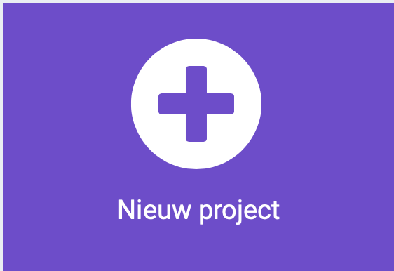

--- /task ---

--- task ---

Geef je nieuwe project de naam `Tijd voor gekkigheid` en klik op **Aanmaken**.

**Tip:** Om het makkelijker te maken om je project later terug te vinden, geef het een logische naam die gerelateerd is aan de activiteit die je aan doen bent.

--- /task ---

### De MakeCode editor

De **MakeCode editor** - gemaakt door de micro:bit Foundation- bevat alles wat je nodig hebt om te beginnen met coderen op de micro:bit.

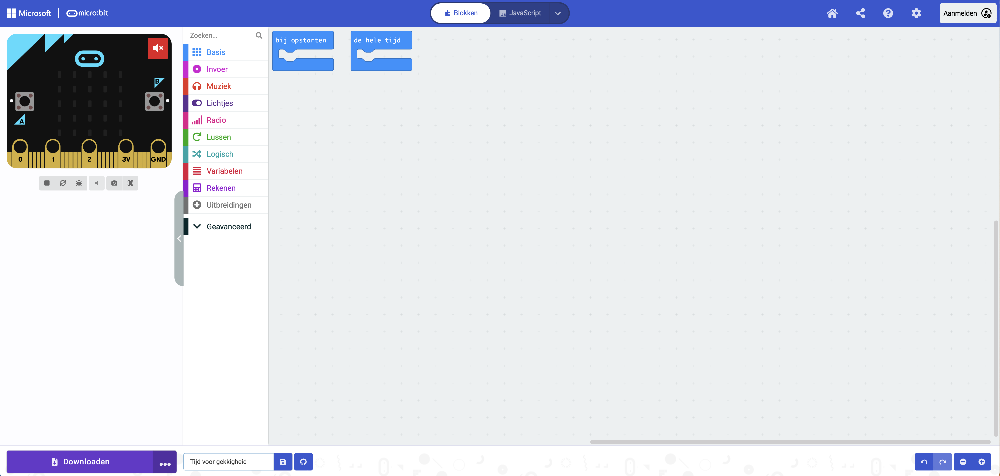

Aan de linkerkant is er een **simulator**. Dit bevat een virtuele micro:bit die je kunt gebruiken om je code te testen!

Het heeft alle functies en knoppen die je op een V2 micro:bit vindt, inclusief:
+ LED display
+ Luidspreker
+ Microfoon
+ Invoerknoppen
    + A
    + B
    + Logo

In het midden staat het **blokken paneel**, dat ingedeeld is per kleur en je toegang geeft tot de verschillende codeblokken.

Aan de rechterkant bevindt zich het **code-editorpaneel**. Dit is waar je blokken sleept en neerzet om je programma te maken.

Het MakeCode editor paneel bevat al twee blokken: <code style="background-color: #1E90FF">bij opstarten</code> en <code style="background-color: #1E90FF">de hele tijd</code>.

### Toon pictogram

Je gebruikt het <code style="background-color: #1E90FF">bij opstarten</code> blok om te zien hoe de LED's op de simulator werken.

--- task ---

Klik op het menu <code style="background-color: #1E90FF">Basis</code>.

Dit zal je uitklappen om de beschikbare blokken te laten zien.

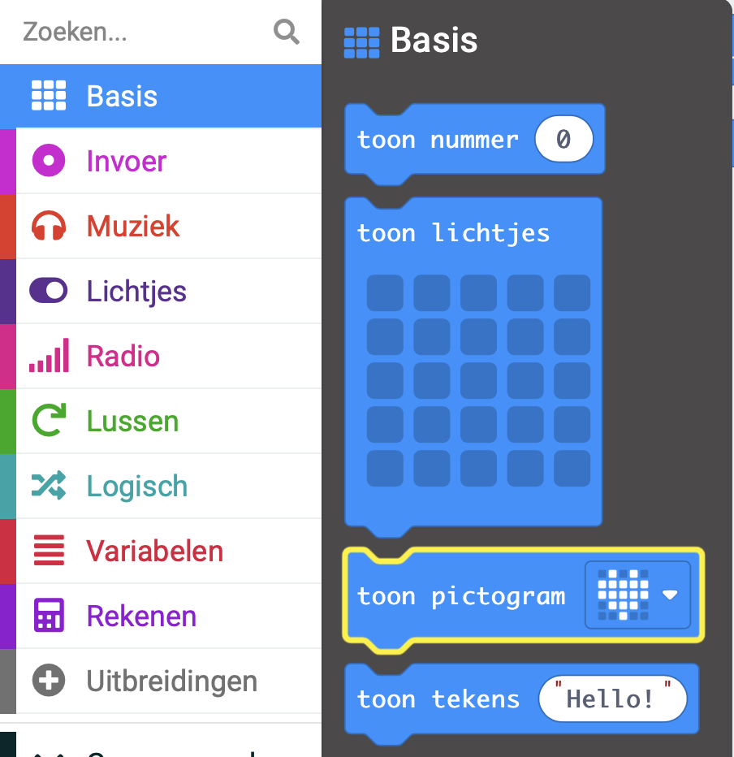

Sleep het <code style="background-color: #1E90FF">toon pictogram</code> blok en zet het neer **in** het <code style="background-color: #1E90FF">bij opstarten</code> blok.

Het moet als een puzzelstuk op zijn plaats passen.

<iframe style="position:relative;top:0;left:0;width:50%;height:100%;" src="https://makecode.microbit.org/---codeembed#pub:_ChCUrqPF77FM" allowfullscreen="allowfullscreen" frameborder="0" sandbox="allow-scripts allow-same-origin"></iframe>

--- /task ---

--- task ---

Klik op de pijl-omlaag op het blok <code style="background-color: #1E90FF">toon pictogram</code> en kies een pictogram.

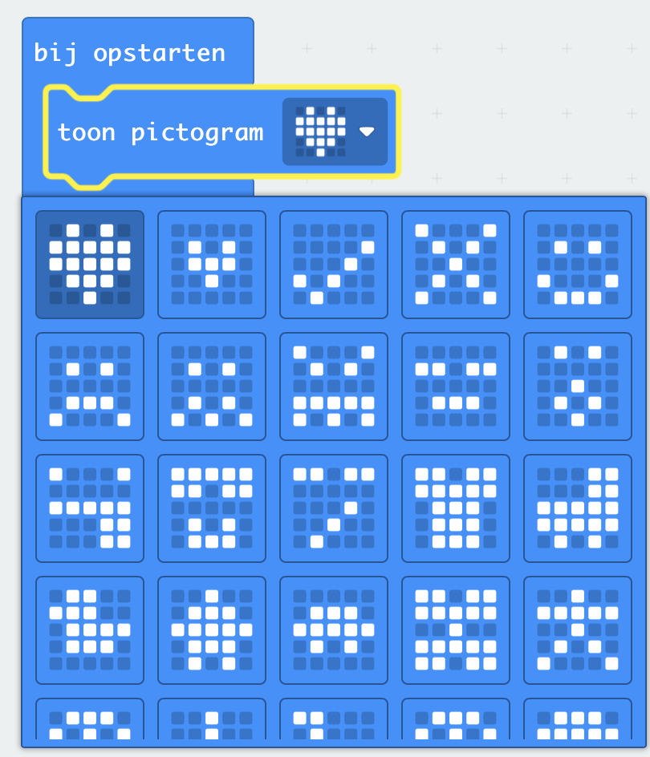

In dit voorbeeld hebben we het `hart` pictogram gekozen.

--- /task ---

--- task ---

**Test:** Het LED-display op de simulator zou moeten oplichten en het door jou gekozen pictogram weergeven.

Goed gedaan! Je hebt de LED's op de micro:bit laten oplichten!

--- /task ---

### Kies een aantal poses

Je zult een aantal gekke gezichten of poses moeten kiezen die je gaat maken wanneer je op een micro:bit-knop drukt. Hier zijn enkele ideeën om je te helpen:

+ Een grote grijns
+ Op en neer springen
+ Doe een boom na
+ Je beste bodybuilder pose

### Maak een timer voor elke pose

Maak een variabele die wordt gebruikt in een timer die aangeeft hoe lang je elke pose moet vasthouden.

--- task ---

Open het menu <code style="background-color: #DC143C">Variabelen</code> en klik op **Maak een variabele**.

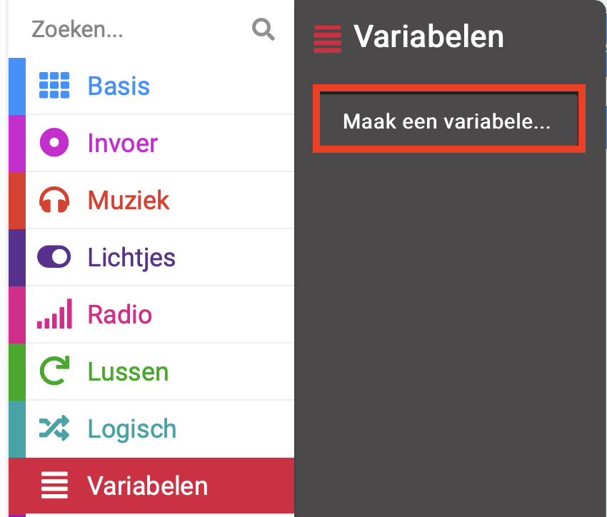

--- /task ---

--- task ---

Noem de nieuwe variabele `timer` en klik vervolgens op de knop **OK**.

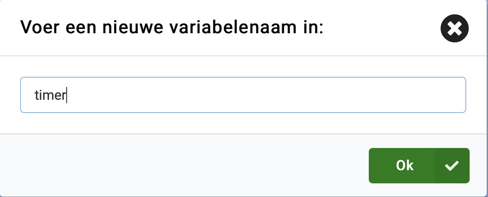

--- /task ---

Er worden nieuwe blokken gemaakt die je in je programma kunt plaatsen om de waarde die opgeslagen wordt in de `timer` variabele te gebruiken en te wijzigen.

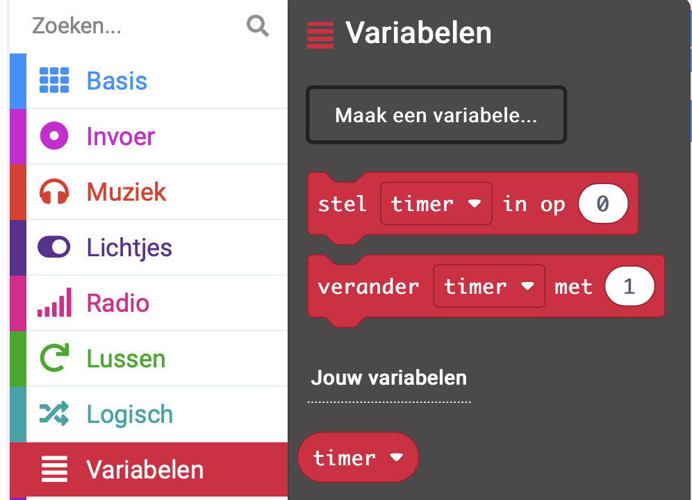

--- task ---

Sleep het <code style="background-color: #DC143C">stel</code> blok **onder** het <code style="background-color: #1E90FF">toon pictogram</code> blok.

<iframe style="position:relative;top:0;left:0;width:50%;height:100%;" src="https://makecode.microbit.org/---codeembed#pub:S59350-24192-35926-97900" allowfullscreen="allowfullscreen" frameborder="0" sandbox="allow-scripts allow-same-origin"></iframe>

--- /task ---

### Stel een pictogram in voor elke pose

Je gaat nu de invoerknoppen A en B op de micro:bit programmeren om je te helpen bij het selecteren welke gekke pose je wilt doen.

--- task ---

Klik op het menu <code style="background-color: #D400D4">Invoer</code> en sleep een <code style="background-color: #D400D4">wanneer knop</code> blok naar het **code editor paneel**.

<iframe style="position:relative;top:0;left:0;width:50%;height:100%;" src="https://makecode.microbit.org/---codeembed#pub:_TUwcRCfFsHCb" allowfullscreen="allowfullscreen" frameborder="0" sandbox="allow-scripts allow-same-origin"></iframe>

--- /task ---

--- task ---

Sleep vanuit het menu <code style="background-color: #1E90FF">Basis</code> het blok met <code style="background-color: #1E90FF">toon lichtjes</code> in het blok <code style="background-color: #D400D4">wanneer knop</code>.

<iframe style="position:relative;top:0;left:0;width:55%;height:100%;" src="https://makecode.microbit.org/---codeembed#pub:_7Ugf5a3JXb81" allowfullscreen="allowfullscreen" frameborder="0" sandbox="allow-scripts allow-same-origin"></iframe>

Klik op de vierkantjes om je pose te tekenen. Witte vierkantjes worden verlicht op het LED-scherm.

In dit voorbeeld hebben we een smiley getekend als gekke pose.

<iframe style="position:relative;top:0;left:0;width:55%;height:100%;" src="https://makecode.microbit.org/---codeembed#pub:_XsR7jJ2wiTAx
" allowfullscreen="allowfullscreen" frameborder="0" sandbox="allow-scripts allow-same-origin"></iframe>

--- /task ---

Het pictogram moet enige tijd worden weergegeven voordat het wordt gewijzigd.

Je gebruikt hiervoor een <code style="background-color: #1E90FF">pauzeer</code> blok. Hierdoor wordt het programma gedurende een bepaald aantal milliseconden (1/1000ste van een seconde) gepauzeerd.

--- task ---

Vanuit het <code style="background-color: #1E90FF">Basis</code> menu sleep je een <code style="background-color: #1E90FF">pauzeer</code> blok onder het <code style="background-color: #1E90FF">toon lichtjes</code> blok.

<iframe style="position:relative;top:0;left:0;width:55%;height:100%;" src="https://makecode.microbit.org/---codeembed#pub:_AVuUqsMq8hbR
" allowfullscreen="allowfullscreen" frameborder="0" sandbox="allow-scripts allow-same-origin"></iframe>

--- /task ---

--- task ---

Verander het getal `100` in het <code style="background-color: #1E90FF">pauzeer</code>blok naar een groter getal zodat de pauze langer is, en het pictogram langer wordt weergegeven. In dit voorbeeld hebben we de tijd ingesteld op 2 seconden (`2000`).

<iframe style="position:relative;top:0;left:0;width:55%;height:100%;" src="https://makecode.microbit.org/---codeembed#pub:_2AcgfYKeAeFu
" allowfullscreen="allowfullscreen" frameborder="0" sandbox="allow-scripts allow-same-origin"></iframe>

--- /task ---

--- task ---

Klik met de rechtermuisknop op het <code style="background-color: #DC143C">stel</code> blok binnen het <code style="background-color: #1E90FF">bij opstarten</code> blok.

Klik op **Dupliceren** om een kopie ervan te maken.

Plaats het gedupliceerde <code style="background-color: #DC143C">stel</code> blok boven het <code style="background-color: #1E90FF">toon lichtjes</code> blok.

Verander het getal `0` naar `10` in het nieuwe blok.

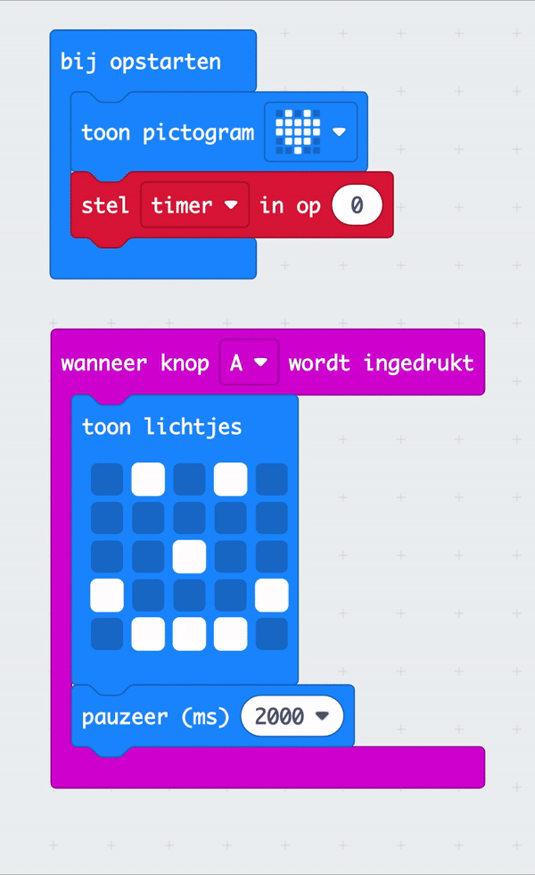

--- /task ---

Om meer dan een pose te kunnen selecteren, gebruik je knop B.

--- task ---

Klik met de rechtermuisknop op het hele <code style="background-color: #D400D4">wanneer op knop</code> blok.

Klik op `Dupliceren` om een kopie ervan te maken.

Je hebt nu twee <code style="background-color: #D400D4">wanneer op knop</code> blokken in het **code editor paneel**.

--- /task ---

--- task ---

Klik op de pijl omlaag naast de <code style="background-color: #D400D4">A</code> op je gedupliceerde <code style="background-color: #D400D4">wanneer op knop</code> blok. Verander de <code style="background-color: #D400D4">A</code> in <code style="background-color: #D400D4">B</code>.

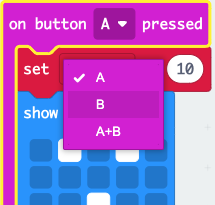

--- /task ---

--- task ---

Om een nieuw pose pictogram te maken, verander je de vierkanten van de nieuwe <code style="background-color: #1E90FF">toon lichtjes</code> blok binnen het nieuwe <code style="background-color: #D400D4">wanneer op knop</code> blok.

--- /task ---

--- task ---

**Test**

+ Klik op knop `A` op de simulator om te zien welk pictogram op de LED wordt weergegeven. Let op hoe lang het zichtbaar is.
+ Doe hetzelfde om knop `B` te testen.
+ Verander de waarde in je <code style="background-color: #1E90FF">pauzeer</code> blok om de tijd die de iconen worden weergegeven te verhogen of te verlagen bij elke druk op de knop.

--- /task ---

### Aftellen aanmaken

Je maakt nu een afteller van 10 seconden.

De variabele waarde van <code style="background-color: #DC143C">timer</code> neemt elke seconde af met `1`, maar **alleen** als de timer **groter is dan 0**.

--- task ---

Sleep vanuit het menu <code style="background-color: #00A4A6">Logisch</code> een <code style="background-color: #00A4A6">als</code> blok.

Plaats het in het <code style="background-color: #1E90FF">de hele tijd</code> blok.

<iframe style="position:relative;top:0;left:0;width:50%;height:100%;" src="https://makecode.microbit.org/---codeembed#pub:_bbCWu0JRuH7u
" allowfullscreen="allowfullscreen" frameborder="0" sandbox="allow-scripts allow-same-origin"></iframe>

--- /task ---

--- task ---

Vanuit het <code style="background-color: #00A4A6">Logisch</code> menu sleep je een <code style="background-color: #00A4A6">0 = 0</code> vergelijkingsblok.

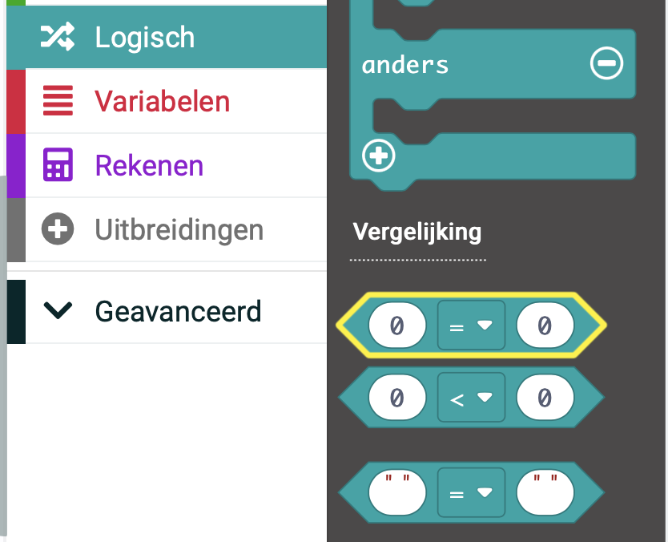

Wijzig de <code style="background-color: #00A4A6">=</code> in een <code style="background-color: #00A4A6"></code> (groter dan) symbool met behulp van de vervolgkeuzepijl op het vergelijkingsblok.

Plaats het vergelijkingsblok in de <code style="background-color: #00A4A6">waar</code> ruimte in het <code style="background-color: #00A4A6">als</code> blok.

<iframe style="position:relative;top:0;left:0;width:60%;height:100%;" src="https://makecode.microbit.org/---codeembed#pub:_5RoV5sKivV2q
" allowfullscreen="allowfullscreen" frameborder="0" sandbox="allow-scripts allow-same-origin"></iframe>

--- /task ---

--- task ---

Sleep vanuit het menu <code style="background-color: #DC143C">Variabelen</code> het blok <code style="background-color: #DC143C">timer</code> en plaats het in de eerste `0` van het blok <code style="background-color: #00A4A6">0 > 0</code>.

<iframe style="position:relative;top:0;left:0;width:50%;height:100%;" src="https://makecode.microbit.org/---codeembed#pub:_ChCUrqPF77FM" allowfullscreen="allowfullscreen" frameborder="0" sandbox="allow-scripts allow-same-origin"></iframe>0

--- /task ---

Om een teller te maken, moet de waarde van de variabele `timer` verminderd worden met `1`.

--- task ---

Sleep vanuit het menu <code style="background-color: #DC143C">Variabelen</code> het blok <code style="background-color: #DC143C">verander</code> en plaats het in de sectie <code style="background-color: #00A4A6">als</code>.

Wijzig `1` in `-1`.

<iframe style="position:relative;top:0;left:0;width:50%;height:100%;" src="https://makecode.microbit.org/---codeembed#pub:_ChCUrqPF77FM" allowfullscreen="allowfullscreen" frameborder="0" sandbox="allow-scripts allow-same-origin"></iframe>1

--- /task ---

--- task ---

Sleep vanuit het menu <code style="background-color: #1E90FF">Basis</code> het blok <code style="background-color: #1E90FF">toon nummer</code> en plaats het onder het blok <code style="background-color: #DC143C">verander</code>.

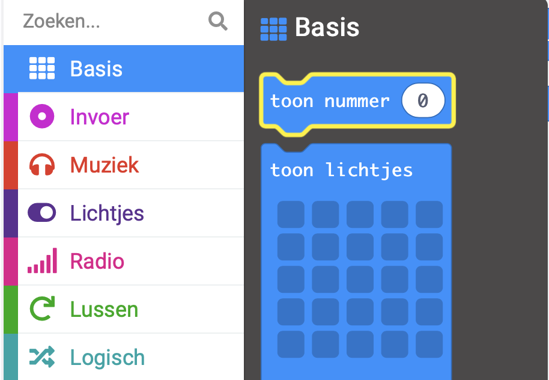

Sleep vanuit het menu <code style="background-color: #DC143C">Variabelen</code> de variabele <code style="background-color: #DC143C">timer</code> binnen de `0` van het <code style="background-color: #1E90FF">toon numer</code> blok.

<iframe style="position:relative;top:0;left:0;width:50%;height:100%;" src="https://makecode.microbit.org/---codeembed#pub:_ChCUrqPF77FM" allowfullscreen="allowfullscreen" frameborder="0" sandbox="allow-scripts allow-same-origin"></iframe>2

--- /task ---

Nadat elke waarde van <code style="background-color: #DC143C">timer</code> wordt weergegeven op de micro:bit, moet je een pauze van 1 seconden toevoegen.

--- task ---

Rechtsklik op een van je <code style="background-color: #1E90FF">pauzeer</code> blokken en dupliceer het.

Sleep het gedupliceerde <code style="background-color: #1E90FF">pauzeer</code> blok onder het <code style="background-color: #1E90FF">toon nummer</code> blok.

Verander `2000` naar `1000`. 

<iframe style="position:relative;top:0;left:0;width:50%;height:100%;" src="https://makecode.microbit.org/---codeembed#pub:_ChCUrqPF77FM" allowfullscreen="allowfullscreen" frameborder="0" sandbox="allow-scripts allow-same-origin"></iframe>3

--- /task ---

Nadat het aftellen is voltooid, zal de waarde 0 zijn.

Je hebt een bericht nodig om de gebruiker te vertellen zijn gekke houding te veranderen.

Dit doe je door een <code style="background-color: #00A4A6">anders</code> sectie toe te voegen aan het <code style="background-color: #00A4A6">als</code> blok.

--- task ---

Klik op het `+` -symbool onderaan het <code style="background-color: #00A4A6">als</code> -blok. Hierdoor wordt een <code style="background-color: #00A4A6">anders</code> blok gemaakt.

Sleep vanuit het menu <code style="background-color: #1E90FF">Basis</code> het blok <code style="background-color: #1E90FF">toon tekens</code> en plaats het in de sectie <code style="background-color: #00A4A6">anders</code>.

Verander de tekst `Hello!` in `Poseren!`.

Vanuit het menu <code style="background-color: #1E90FF">Basis</code> sleep je het blok <code style="background-color: #1E90FF">wis scherm</code> en zet het neer **boven** het blok <code style="background-color: #1E90FF">toon tekens</code>.

<iframe style="position:relative;top:0;left:0;width:50%;height:100%;" src="https://makecode.microbit.org/---codeembed#pub:_ChCUrqPF77FM" allowfullscreen="allowfullscreen" frameborder="0" sandbox="allow-scripts allow-same-origin"></iframe>4

--- /task ---

--- collapse ---

---
title: Voeg geluid toe voor een dramatisch effect
---

Sleep vanuit het menu <code style="background-color: #E63022">Muziek</code> een <code style="background-color: #E63022">play tone</code> blok.

Plaats het onder het <code style="background-color: #DC143C">verander</code> blok.

Klik op het vervolgkeuzemenu bij `Middle C` en er verschijnt een pianotoetsen console.

Kies een toon voor je timer.

We hebben `Middle A` geselecteerd.

Klik op het <code style="background-color: #E63022">tot het klaar is</code> vervolgkeuzemenu en verander het naar <code style="background-color: #E63022">in background</code>.

<iframe style="position:relative;top:0;left:0;width:50%;height:100%;" src="https://makecode.microbit.org/---codeembed#pub:_ChCUrqPF77FM" allowfullscreen="allowfullscreen" frameborder="0" sandbox="allow-scripts allow-same-origin"></iframe>5

--- /collapse ---

--- task ---

**Test** je programma op de simulator:

+ **Klik** knop A om het pose pictogram weer te geven.

+ **Klik** knop B om een ander pictogram te zien verschijnen.

+ **Check** of de afteltimer werkt en terugtelt vanaf 10.

+ **Controleer** of er een toon wordt gespeeld terwijl elke seconde aftelt.

--- /task ---

--- task ---

[[[download-to-microbit]]]

--- /task ---

--- task ---

**Test** je programma op de fysieke micro:bit.

--- /task ---

### Verbeter je project

Je kunt je tijd voor gekkigheid project upgraden door:

+ Nog een gekke pose toegevoegd die te zien is als je tegelijkertijd op de knoppen A en B drukt (`A+B`)
+ Verhoog de hoeveelheid tijd tussen de poses