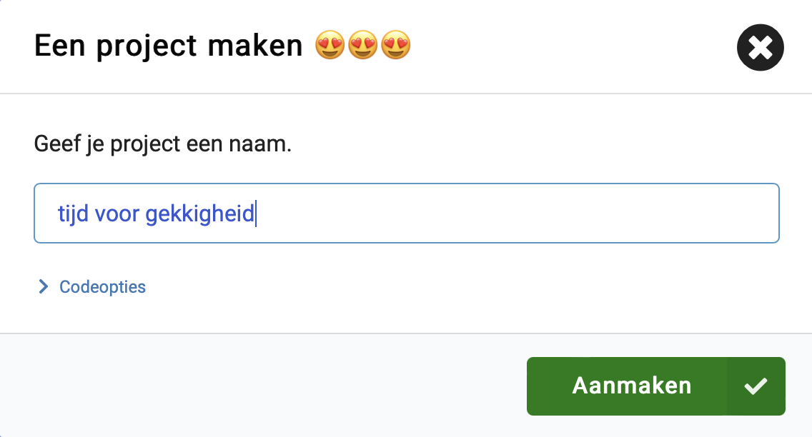
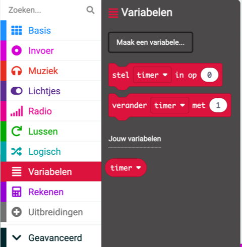
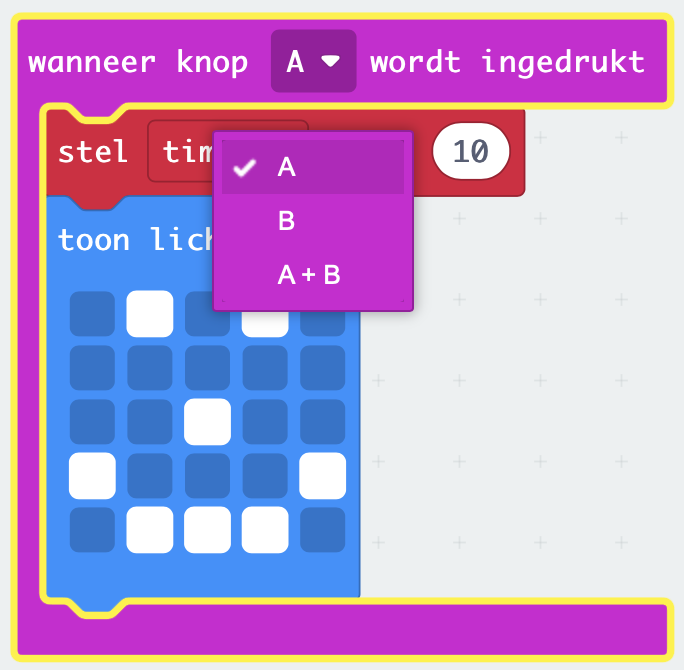

De **micro:bit** is een kleine computer die je kunt gebruiken om te communiceren met de wereld om je heen.

Dit project helpt je te **ontdekken** wat de **micro:bit** kan doen.

### Wat ga je maken

Dit project herinnert je eraan om tijd vrij te maken om gek te doen, plezier te hebben en te poseren in n maffe houding! Dit kan na een lange schooldag zijn, of als een manier om jou en je vrienden op te vrolijken. Je kunt de micro:bit-knoppen programmeren om je te helpen herinneren dat het tijd is om plezier te maken.

In dit project maak je een **timer voor gekkigheid**.

Je gaat:
+ Pictogrammen, tekst en cijfers laten zien op de LED's
+ Use `if`{:class='microbitlogic'} blocks to control what is displayed
+ Use the `pause`{:class='microbitbasic'} block to create a countdown timer
+ Geluiden afspelen
+ Knoppen gebruiken om het scherm te wijzigen

--- no-print ---

### Afspelen ▶️

--- task ---

+ Wat gebeurt er wanneer het programma start?
+ Wat gebeurt er als het aftellen loopt?
+ Wat gebeurt er als het aftellen is afgelopen?
+ Wat gebeurt er als je op knop A `drukt`?
+ Wat gebeurt er als je op knop B `drukt`?

<div style="position:relative;height:100%;padding-bottom:125%;padding-top:0;overflow:hidden;">
<iframe style="position:absolute;top:0;left:0;width:100%;height:100%;" src="https://makecode.microbit.org/---run?id=_KiYLAWM3cip4" allowfullscreen="allowfullscreen" sandbox="allow-popups allow-forms allow-scripts allow-same-origin" frameborder="0"></iframe>
</div>

--- /task ---

--- /no-print ---

### MakeCode openen

Om je micro:bit-project te maken, moet je eerst de MakeCode-editor openen.

--- task ---

Open de MakeCode editor op [makecode.microbit.org](https://makecode.microbit.org)

--- collapse ---

---
title: Offline versie van de editor
---

Er is ook een [downloadbare versie van de MakeCode editor](https://makecode.microbit.org/offline-app).

--- /collapse ---

--- /task ---

Zodra de editor is geopend, moet je een nieuw project aanmaken en je project een naam geven.

--- task ---

Klik op de knop **Nieuw Project**.


--- /task ---

--- task ---

Geef je nieuwe project de naam `Tijd voor gekkigheid` en klik op **Aanmaken**.



**Tip:** Om het makkelijker te maken om je project later terug te vinden, geef het een logische naam die gerelateerd is aan de activiteit die je aan doen bent.

--- /task ---

### De MakeCode editor

De **MakeCode editor** - gemaakt door de micro:bit Foundation- bevat alles wat je nodig hebt om te beginnen met coderen op de micro:bit.


Aan de linkerkant is er een **simulator**. Dit bevat een virtuele micro:bit die je kunt gebruiken om je code te testen!

Het heeft alle functies en knoppen die je op een V2 micro:bit vindt, inclusief:
+ LED display
+ Luidspreker
+ Microfoon
+ Invoerknoppen
    + A
    + B
    + Logo

In het midden staat het **blokken paneel**, dat ingedeeld is per kleur en je toegang geeft tot de verschillende codeblokken.

Aan de rechterkant bevindt zich het **code-editorpaneel**. Dit is waar je blokken sleept en neerzet om je programma te maken.

Het MakeCode editor paneel bevat al twee blokken: <code style="background-color: #1E90FF">bij opstarten</code> en <code style="background-color: #1E90FF">de hele tijd</code>.

### Toon pictogram

Je gebruikt het <code style="background-color: #1E90FF">bij opstarten</code> blok om te zien hoe de LED's op de simulator werken.

--- task ---

Klik op het menu <code style="background-color: #1E90FF">Basis</code>.

Dit zal je uitklappen om de beschikbare blokken te laten zien.


Drag the `show iccon`{:class='microbitbasic'} block and place it **inside** the `on start`{:class='microbitbasic'} block.

Het moet als een puzzelstuk op zijn plaats passen.

```microbit
basic.showIcon(IconNames.Heart)
```

--- /task ---

--- task ---

Klik op de pijl-omlaag op het blok <code style="background-color: #1E90FF">toon pictogram</code> en kies een pictogram.


In dit voorbeeld hebben we het `hart` pictogram gekozen.

--- /task ---

--- task ---

**Test:** Het LED-display op de simulator zou moeten oplichten en het door jou gekozen pictogram weergeven.

Goed gedaan! Je hebt de LED's op de micro:bit laten oplichten!

--- /task ---

### Kies een aantal poses

Je zult een aantal gekke gezichten of poses moeten kiezen die je gaat maken wanneer je op een micro:bit-knop drukt. Hier zijn enkele ideeën om je te helpen:

+ Een grote grijns
+ Op en neer springen
+ Doe een boom na
+ Je beste bodybuilder pose

### Maak een timer voor elke pose

Maak een variabele die wordt gebruikt in een timer die aangeeft hoe lang je elke pose moet vasthouden.

--- task ---

Open het menu <code style="background-color: #DC143C">Variabelen</code> en klik op **Maak een variabele**.


--- /task ---

--- task ---

Noem de nieuwe variabele `timer` en klik vervolgens op de knop **OK**.


--- /task ---

Er worden nieuwe blokken gemaakt die je in je programma kunt plaatsen om de waarde die opgeslagen wordt in de `timer` variabele te gebruiken en te wijzigen.



--- task ---

Drag the `set`{:class='microbitvariables'} block **under** the `show icon`{:class='microbitbasic'} block.

```microbit
let timer = 0
basic.forever(function () {
    basic.showIcon(IconNames.Heart)
    timer = 0
})
```

--- /task ---

### Stel een pictogram in voor elke pose

Je gaat nu de invoerknoppen A en B op de micro:bit programmeren om je te helpen bij het selecteren welke gekke pose je wilt doen.

--- task ---

Klik op het menu <code style="background-color: #D400D4">Invoer</code> en sleep een <code style="background-color: #D400D4">wanneer knop</code> blok naar het **code editor paneel**.

```microbit
input.onButtonPressed(Button.A, function () {

})
```

--- /task ---

--- task ---

From the `Basic`{:class='microbitbasic'} menu, drag the `show leds`{:class='microbitbasic'} block inside the `on button`{:class='microbitinput'} block.

```microbit
input.onButtonPressed(Button.A, function () {
    basic.showLeds(`
        . . . . .
        . . . . .
        . . . . .
        . . . . .
        . . . . .
        `)
})
```

Klik op de vierkantjes om je pose te tekenen. Witte vierkantjes worden verlicht op het LED-scherm.

In dit voorbeeld hebben we een smiley getekend als gekke pose.

```microbit
input.onButtonPressed(Button.A, function () {
    basic.showLeds(`
        . # . # .
        . . . . .
        . . # . .
        # . . . #
        . # # # .
        `)
})
```

--- /task ---

Het pictogram moet enige tijd worden weergegeven voordat het wordt gewijzigd.

You will use a `pause`{:class='microbitbasic'} block for this. Hierdoor wordt het programma gedurende een bepaald aantal milliseconden (1/1000ste van een seconde) gepauzeerd.

--- task ---

From the `Basic`{:class='microbitbasic'} menu, drag a `pause`{:class='microbitbasic'} block below the `show leds`{:class='microbitbasic'} block.

```microbit
input.onButtonPressed(Button.A, function () {
    basic.showLeds(`
        . # . # .
        . . . . .
        . . # . .
        # . . . #
        . # # # .
        `)
    basic.pause(100)
})
```

--- /task ---

--- task ---

Verander het getal `100` in het <code style="background-color: #1E90FF">pauzeer</code>blok naar een groter getal zodat de pauze langer is, en het pictogram langer wordt weergegeven. In dit voorbeeld hebben we de tijd ingesteld op 2 seconden (`2000`).

```microbit
input.onButtonPressed(Button.A, function () {
    basic.showLeds(`
        . # . # .
        . . . . .
        . . # . .
        # . . . #
        . # # # .
        `)
    basic.pause(2000)
})
```

--- /task ---

--- task ---

Right-click on the `set`{:class='microbitvariables'} block inside the `on start`{:class='microbitbasic'} block.

Klik op **Dupliceren** om een kopie ervan te maken.

Place the duplicated `set`{:class='microbitvariables'} block above the `show leds`{:class='microbitbasic'} block.

Verander het getal `0` naar `10` in het nieuwe blok.


--- /task ---

Om meer dan een pose te kunnen selecteren, gebruik je knop B.

--- task ---

Klik met de rechtermuisknop op het hele <code style="background-color: #D400D4">wanneer op knop</code> blok.

Klik op `Dupliceren` om een kopie ervan te maken.

Je hebt nu twee <code style="background-color: #D400D4">wanneer op knop</code> blokken in het **code editor paneel**.

--- /task ---

--- task ---

Click the down arrow next to the `A`{:class='microbitinput'} on your duplicated `on button`{:class='microbitinput'} block. Change the `A`{:class='microbitinput'} to `B`{:class='microbitinput'}.



--- /task ---

--- task ---

Om een nieuw pose pictogram te maken, verander je de vierkanten van de nieuwe <code style="background-color: #1E90FF">toon lichtjes</code> blok binnen het nieuwe <code style="background-color: #D400D4">wanneer op knop</code> blok.

--- /task ---

--- task ---

**Test**

+ Klik op knop `A` op de simulator om te zien welk pictogram op de LED wordt weergegeven. Let op hoe lang het zichtbaar is.
+ Doe hetzelfde om knop `B` te testen.
+ Verander de waarde in je <code style="background-color: #1E90FF">pauzeer</code> blok om de tijd die de iconen worden weergegeven te verhogen of te verlagen bij elke druk op de knop.

--- /task ---

### Aftellen aanmaken

Je maakt nu een afteller van 10 seconden.

De variabele waarde van <code style="background-color: #DC143C">timer</code> neemt elke seconde af met `1`, maar **alleen** als de timer **groter is dan 0**.

--- task ---

From the `Logic`{:class='microbitlogic'} menu, drag an `if`{:class='microbitlogic'} block.

Place it in the `forever`{:class='microbitbasic'} block.

```microbit
basic.forever(function () {
    if (true) {

    }
})
```

--- /task ---

--- task ---

Vanuit het <code style="background-color: #00A4A6">Logisch</code> menu sleep je een <code style="background-color: #00A4A6">0 = 0</code> vergelijkingsblok.


Change the `=`{:class='microbitlogic'} to a `>`{:class='microbitlogic'} (greater than) symbol using the drop-down arrow on the comparison block.

Place the comparison block inside the `true`{:class='microbitlogic'} space in the `if`{:class='microbitlogic'} block.

```microbit
basic.forever(function () {
    if (0 > 0) {

    }
})
```

--- /task ---

--- task ---

From the `Variables`{:class='microbitvariables'} menu, drag the `timer`{:class='microbitvariables'} block and place it inside the first `0` in the `0 > 0`{:class='microbitlogic'} block.

```microbit
basic.forever(function () {
    let timer = 0
    if (timer > 0) {

    }
})
```

--- /task ---

Om een teller te maken, moet de waarde van de variabele `timer` verminderd worden met `1`.

--- task ---

From the `Variables`{:class='microbitvariables'} menu, drag the `change`{:class='microbitvariables'} block and place it inside the `if`{:class='microbitlogic'} section.

Wijzig `1` in `-1`.

```microbit
let timer = 0
basic.forever(function () {
    if (timer > 0) {
        timer += -1
    }
})
```

--- /task ---

--- task ---

From the `Basic`{:class='microbitbasic'} menu, drag the `show number`{:class='microbitbasic'} block and place it below the `change`{:class='microbitvariables'} block.


From the `Variables`{:class='microbitvariables'} menu, drag the `timer`{:class='microbitvariables'} variable inside the `0` on the `show number`{:class='microbitbasic'} block.

```microbit
let timer = 0
basic.forever(function () {
    if (timer > 0) {
        timer += -1
        basic.showNumber(timer)
    }
})
```

--- /task ---

Nadat elke waarde van <code style="background-color: #DC143C">timer</code> wordt weergegeven op de micro:bit, moet je een pauze van 1 seconden toevoegen.

--- task ---

Right-click on one of your `pause`{:class='microbitbasic'} blocks and duplicate it.

Drag the duplicated `pause`{:class='microbitbasic'} block below the `show number`{:class='microbitbasic'} block.

Verander `2000` naar `1000`.

```microbit
let timer = 0
basic.forever(function () {
    if (timer > 0) {
        timer += -1
        basic.showNumber(timer)
        basic.pause(1000)
    }
})
```

--- /task ---

Nadat het aftellen is voltooid, zal de waarde 0 zijn.

Je hebt een bericht nodig om de gebruiker te vertellen zijn gekke houding te veranderen.

You will do this by adding an `else`{:class='microbitlogic'} section to the `if`{:class='microbitlogic'} block.

--- task ---

Klik op het `+` -symbool onderaan het <code style="background-color: #00A4A6">als</code> -blok. Hierdoor wordt een <code style="background-color: #00A4A6">anders</code> blok gemaakt.

From the `Basic`{:class='microbitbasic'} menu, drag the `show string`{:class='microbitbasic'} block and place it inside the `else`{:class='microbitlogic'} section.

Verander de tekst `Hello!` in `Poseren!`.

From the `Basic`{:class='microbitbasic'} menu, drag the `clear screen`{:class='microbitbasic'} block and drop it **above** the `show string`{:class='microbitbasic'} block.

```microbit
let timer = 0
basic.forever(function () {
    if (timer > 0) {
        timer += -1
        basic.showNumber(timer)
        basic.pause(1000)
    } else {
        basic.clearScreen()
        basic.showString("Pose!")
    }
})
```

--- /task ---

--- collapse ---

---
title: Voeg geluid toe voor een dramatisch effect
---

Sleep vanuit het menu <code style="background-color: #E63022">Muziek</code> een <code style="background-color: #E63022">play tone</code> blok.

Place it below the `change`{:class='microbitvariables'} block.

Klik op het vervolgkeuzemenu bij `Middle C` en er verschijnt een pianotoetsen console.

Kies een toon voor je timer.

We hebben `Middle A` geselecteerd.

Klik op het <code style="background-color: #E63022">tot het klaar is</code> vervolgkeuzemenu en verander het naar <code style="background-color: #E63022">in background</code>.

```microbit
let timer = 0
basic.forever(function () {
    if (timer > 0) {
        timer += -1
        music.play(music.tonePlayable(440, music.beat(BeatFraction.Whole)), music.PlaybackMode.InBackground)
        basic.showNumber(timer)
        basic.pause(1000)
    } else {
        basic.clearScreen()
        basic.showString("Pose!")
    }
})
```

--- /collapse ---

--- task ---

**Test** je programma op de simulator:

+ **Klik** knop A om het pose pictogram weer te geven.

+ **Klik** knop B om een ander pictogram te zien verschijnen.

+ **Check** of de afteltimer werkt en terugtelt vanaf 10.

+ **Controleer** of er een toon wordt gespeeld terwijl elke seconde aftelt.

--- /task ---

--- task ---

[[[download-to-microbit]]]

--- /task ---

--- task ---

**Test** je programma op de fysieke micro:bit.

--- /task ---

### Verbeter je project

If you want to check your code you can can find [the completed project here](https://makecode.microbit.org/_8K430qR3oH7t).

### Verbeter je project

Je kunt je tijd voor gekkigheid project upgraden door:

+ Nog een gekke pose toegevoegd die te zien is als je tegelijkertijd op de knoppen A en B drukt (`A+B`)
+ Verhoog de hoeveelheid tijd tussen de poses